<div align="center">

# Buzzly Marketing Platform

A full-stack marketing SaaS platform built with React, TypeScript, and Supabase.


</div>

---

## What is this?

Buzzly is a marketing platform where businesses can connect their ad accounts (Facebook, Google, TikTok, etc.), track campaign performance, manage social media content, and analyze customer data — all in one place.

It's not just a dashboard. It has a full role-based system with separate portals for business owners, support staff, developers, and end customers. There's also a loyalty/gamification layer with tiers, points, missions, and rewards.

We built this as a university project to learn how a real SaaS product works end-to-end: auth flows, database design, RLS security, API integrations, role management, and deployment.

## 📸 Platform Showcase

### 📊 Business Intelligence & Analytics
The core dashboard for business users to track ad performance across all platforms.
<div align="center">
  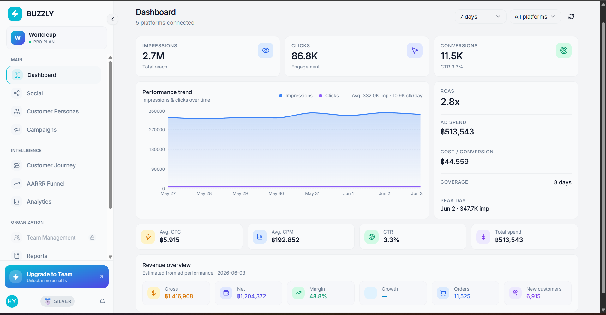
</div>

<br/>

**Deep Dive Analytics**
| Analytics Hub | Campaign Management |
|:-:|:-:|
| 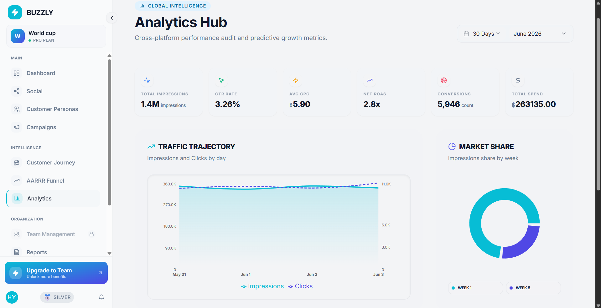 | 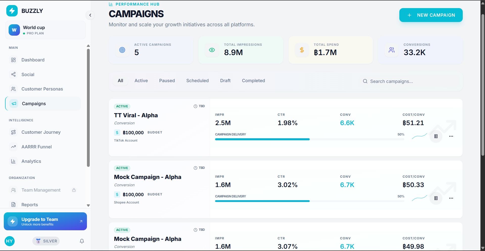 |
| *Cross-platform performance audit.* | *Monitor and scale growth initiatives.* |

### 🎯 Audience & Social Media
Understand who your customers are and engage with them directly.

| Customer Personas | Social Planner |
|:-:|:-:|
| 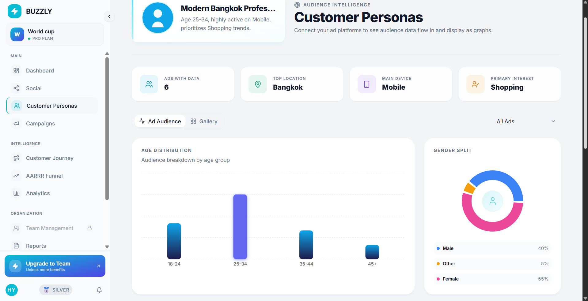 | 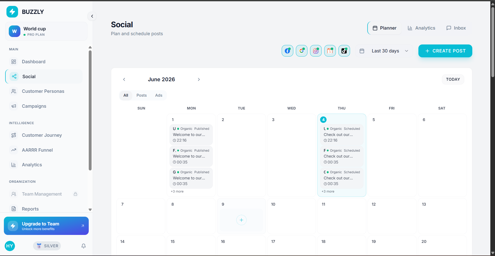 |
| *Aggregated demographics and interests.* | *Plan and schedule social posts.* |

### 🚀 Funnels & Journey Mapping
Track users from their first impression to successful conversion.

| AARRR Funnel | Customer Journey |
|:-:|:-:|
| 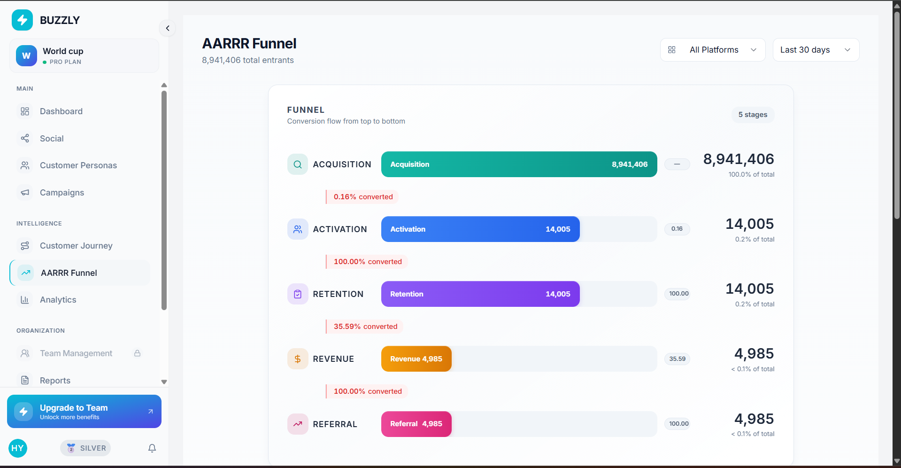 | 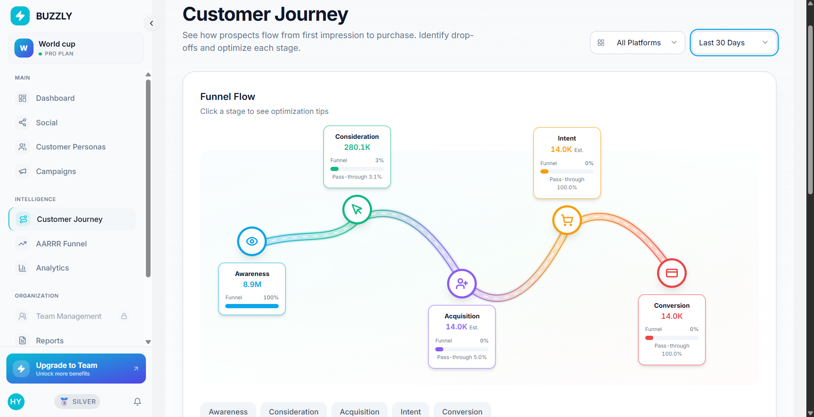 |
| *Pirate metrics conversion flow.* | *Visualizing the path to purchase.* |

### ⚙️ Management & Operations
Robust tools for team management, API integrations, and loyalty programs.

| Team & Roles | Platform Integrations |
|:-:|:-:|
| 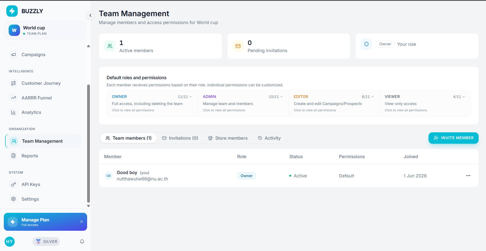 | 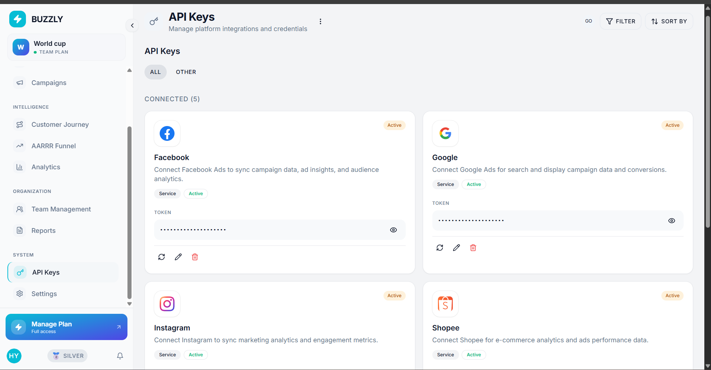 |
| *Granular RBAC for team members.* | *Connect Meta, Google, TikTok, etc.* |

| Loyalty Settings | Reports & Exports |
|:-:|:-:|
| 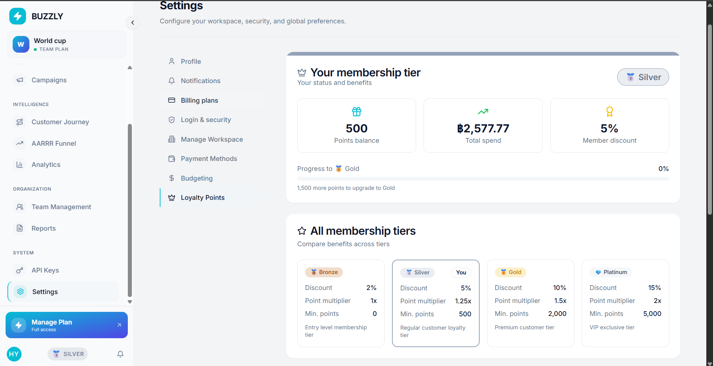 | 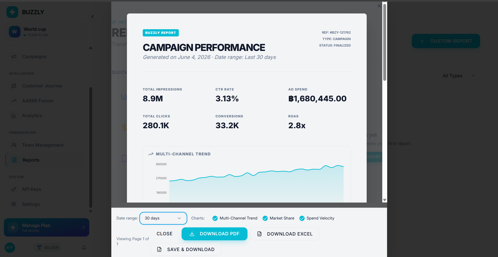 |
| *Configure tiers, points, and rewards.* | *Generate beautiful PDF performance reports.* |

## Features

### For Business Users
- **Dashboard** — Real-time metrics with spend, impressions, clicks, conversions, and ROAS over configurable date ranges
- **Campaign Manager** — Create, edit, and track campaigns with KPI targets and budget controls
- **Social Media** — Content calendar, post scheduling, inbox for comments, and engagement analytics
- **Customer Personas** — Audience breakdowns by age, gender, device, location (with a geographic map), and interests. Data is aggregated across ads using weighted averages by impressions
- **API Keys** — Connect platforms (Facebook, Google, TikTok, Instagram, Shopee) via API keys. Includes test keys for demo purposes that auto-generate mock data
- **Analytics** — Deeper performance charts, trend analysis, and custom date filtering
- **AARRR Funnel** — Acquisition → Activation → Retention → Referral → Revenue breakdown
- **Customer Journey** — Visualize touchpoints from awareness to conversion
- **Reports** — Generate and export PDF/Excel reports, schedule recurring reports

### For Business Owners
- **Owner Dashboard** — MRR, churn rate, growth metrics, and revenue breakdown
- **Business Performance** — Financial analytics with trend comparisons
- **Tier Management** — Configure loyalty tiers with automatic upgrade/downgrade rules
- **Product Usage** — Track feature adoption, active users, and system health
- **User Feedback** — View and manage feedback submitted by customers
- **Audit Logs** — Full audit trail of system actions for compliance

### For Dev/Support Staff
- **Monitor Dashboard** — Server health, API latency, error rates, and real-time system status
- **Workspace Management** — View and manage all business workspaces
- **Support Tickets** — Handle customer issues with search and status tracking
- **Employee Management** — Approve/reject employee signups, manage roles
- **Discount & Rewards** — Manage discount codes, reward items, and redemption requests

### For End Customers
- **Loyalty System** — Earn points through purchases and missions, redeem for rewards
- **Tier Progression** — Bronze → Silver → Gold → Platinum with automatic evaluation
- **Reward Center** — Browse and redeem available rewards using loyalty points
- **Coupons** — View and apply discount codes

## Tech Stack

| Layer | Tech |
|-------|------|
| Frontend | React 18, TypeScript, Vite |
| Styling | Tailwind CSS, shadcn/ui (Radix primitives) |
| State & Data | TanStack React Query, React Hook Form, Zod |
| Charts | Recharts, react-simple-maps |
| Backend | Supabase (PostgreSQL, Auth, Storage, RLS) |
| Testing | Vitest (unit), Playwright (E2E) |
| Deployment | Vercel |

## Architecture

```
┌─────────────────────────────────────────────────────┐
│                    Frontend (React + Vite)           │
│  ┌──────────┐  ┌──────────┐  ┌───────────────────┐  │
│  │  Pages   │  │  Hooks   │  │    Components     │  │
│  │  (25+)   │  │  (78)    │  │    (280+)         │  │
│  └────┬─────┘  └────┬─────┘  └───────────────────┘  │
│       │              │                               │
│       └──────┬───────┘                               │
│              ▼                                       │
│     React Query (cache + sync)                       │
└──────────────┬───────────────────────────────────────┘
               │
               ▼
┌─────────────────────────────────────────────────────┐
│              Supabase                               │
│  ┌──────────┐  ┌──────────┐  ┌──────────────────┐  │
│  │   Auth   │  │ Storage  │  │    PostgreSQL     │  │
│  │  (JWT)   │  │ (files)  │  │  227 migrations   │  │
│  └──────────┘  └──────────┘  │  50+ tables       │  │
│                              │  RLS on every table│  │
│                              └──────────────────┘  │
└─────────────────────────────────────────────────────┘
```

## Project Structure

```
src/
├── components/         # UI components organized by feature
│   ├── ui/             # Base components (shadcn/ui)
│   ├── dashboard/      # Dashboard widgets
│   ├── campaigns/      # Campaign management
│   ├── social/         # Social media (calendar, inbox, analytics)
│   ├── persona/        # Customer persona cards and charts
│   ├── admin/          # Admin/dev portal components
│   ├── owner/          # Owner portal components
│   ├── customer/       # Customer-facing components
│   ├── team/           # Team management
│   └── ...
├── hooks/              # 78 custom hooks for data fetching & business logic
├── pages/              # Route-level page components
│   ├── owner/          # Owner portal pages
│   ├── dev/            # Dev/admin portal pages
│   ├── support/        # Support staff pages
│   ├── social/         # Social media pages
│   └── employee/       # Employee auth pages
├── lib/                # Utilities, mock data, seed functions
├── integrations/       # Supabase client setup
├── constants/          # Plan configs, feature flags
└── services/           # Error logging, external services

supabase/
└── migrations/         # 227 SQL migration files

e2e/                    # 9 Playwright test suites
mock-api/               # Mock API server for testing
```

## Role-Based Access Control

The system has 5 distinct user roles, each with its own set of pages and permissions:

| Role | Access | Description |
|------|--------|-------------|
| **User** | Dashboard, Campaigns, Social, Personas, Analytics | Regular business user |
| **Owner** | Everything above + Owner Dashboard, Business Performance, Tier Mgmt | Business owner with full platform access |
| **Dev** | Monitor Dashboard, Workspaces, Audit Logs | Developer/admin with system-level access |
| **Support** | Tier Management, Discounts, Rewards, Redemptions | Support staff for customer operations |
| **Customer** | Loyalty, Rewards, Coupons | End customer interacting with the loyalty system |

Access is enforced at two levels:
1. **Frontend** — Route guards and conditional rendering based on role
2. **Database** — Row-Level Security (RLS) policies on every table, so even if someone bypasses the UI, the database won't return data they shouldn't see

## Database

The database has 50+ tables with full RLS coverage. Here are the main ones:

**Core:** `workspaces`, `workspace_members`, `user_roles`, `profiles`, `employees`

**Marketing:** `campaigns`, `ad_accounts`, `ad_groups`, `ads`, `ad_insights`, `social_posts`

**Personas:** `customer_personas`, `ad_personas`, `persona_metrics_daily`

**Loyalty:** `loyalty_points`, `loyalty_tiers`, `loyalty_missions`, `reward_items`, `user_redeemed_coupons`

**System:** `audit_logs`, `notifications`, `error_logs`, `sync_history`

Key database features:
- **227 migrations** tracking every schema change
- **RLS policies** on every table with helper functions (`is_team_member()`, `can_manage_team()`, `has_role()`)
- **Triggers** for automatic tier evaluation, wallet creation on signup, notification generation
- **RPCs** for complex operations like reward redemption, manual tier override, customer search

## Getting Started

### Prerequisites
- Node.js 18+
- A Supabase project (or use the existing one via `.env`)

### Setup

```bash
# Clone the repo
git clone https://github.com/Nokpednam/buzzly-marketing-platform.git
cd buzzly-marketing-platform

# Install dependencies
npm install

# Set up environment variables
cp .env.example .env
# Fill in your Supabase URL and anon key

# Run the dev server
npm run dev
```

### Available Scripts

```bash
npm run dev          # Start dev server
npm run build        # Production build
npm run test         # Run unit tests (Vitest)
npm run test:e2e     # Run E2E tests (Playwright)
npm run seed         # Seed demo business data
npm run lint         # ESLint
```

## Testing

**Unit tests** — 23 test files using Vitest + React Testing Library, covering hooks and component logic:
```bash
npm run test              # Run all
npm run test:monitor      # Admin monitor tests
npm run test:audit        # Audit logs tests
npm run test:employee     # Employee management tests
npm run test:tier         # Tier management tests
npm run test:loyalty      # Loyalty system tests
```

**E2E tests** — 9 Playwright test suites covering full user flows:
- Authentication flow
- Campaign management
- Team management
- Employee management
- Settings management
- Owner portal flow
- Customer portal flow
- Admin flow
- UI validation

## What I Learned

Building this project taught me a lot about how real SaaS products work:

- **Database design at scale** — Designing normalized schemas with proper foreign keys, dealing with data that spans multiple tables, and writing migrations that don't break existing data
- **Row-Level Security** — Probably the hardest part. Getting RLS policies right so that each team only sees their own data, while admin roles can see everything, required a lot of debugging
- **State management** — Using React Query for server state instead of trying to keep everything in local state. Understanding cache invalidation and optimistic updates
- **Role-based architecture** — Building a system where the same codebase serves completely different UIs depending on who's logged in
- **Real-world data flows** — Connecting external platforms via API keys, ingesting data, transforming it for display, and handling failures gracefully

---

## Team

Built by students at Naresuan University.

| Name | GitHub |
|------|--------|
| Natthawut Wanma | [@Nokpednam](https://github.com/Nokpednam) |
| Kittikorn Maekuadee | — |
| Panuwat | [@Panuwat-JR](https://github.com/Panuwat-JR) |
| Natchaporn | [@natchapornp66-sudo](https://github.com/natchapornp66-sudo) |
| Supas | — |
| Tanatron | — |
| LunaDogZ | [@LunaDogZ](https://github.com/LunaDogZ) |
