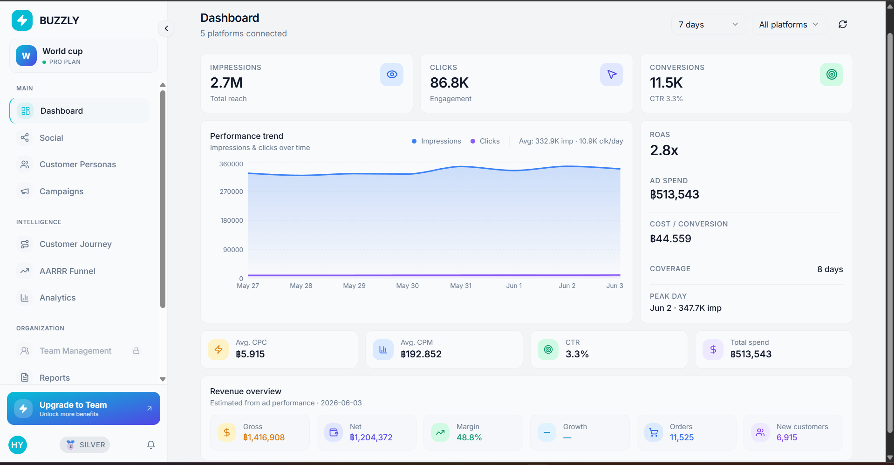
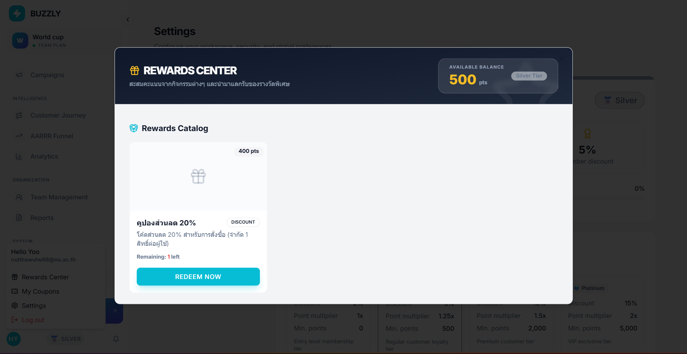
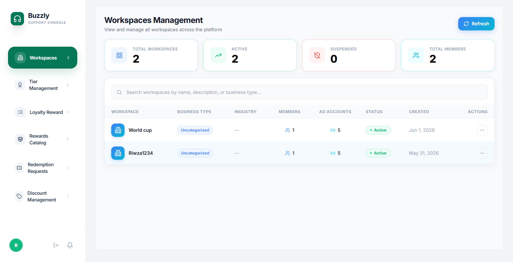
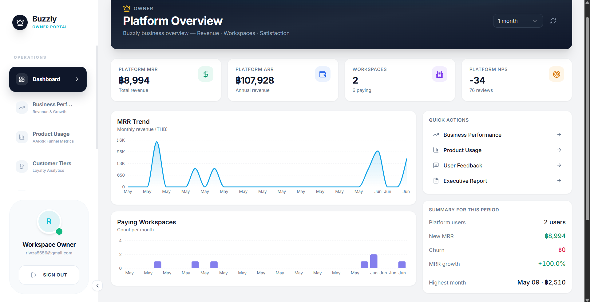
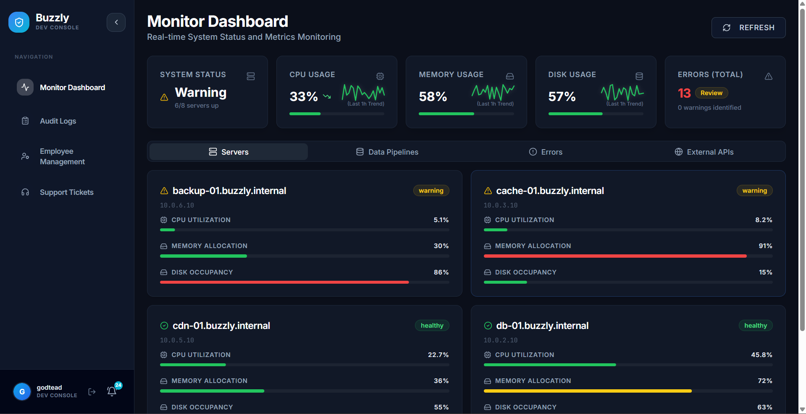

# Buzzly Marketing Platform

A marketing management web application built with React, TypeScript, and Supabase.

## Overview
Buzzly is a web application where businesses can track advertising campaign performance, analyze customer personas, and manage social media content. It includes role-based views for customer and internal management workflows, with access enforced through application permissions and Supabase RLS.

## Tech Stack
| Layer | Technology |
|-------|------------|
| Frontend | React 18, TypeScript, Vite |
| Styling | Tailwind CSS, shadcn/ui |
| State | TanStack React Query, React Hook Form, Zod |
| Charts | Recharts, react-simple-maps |
| Backend | Supabase (PostgreSQL, Auth, Storage, RLS) |
| Testing | Vitest, Playwright |

## Architecture & Data Flow
- **Frontend**: React and TypeScript architecture using React Query for server state management.
- **Backend**: Supabase backend utilizing PostgreSQL. Data access is enforced through Row-Level Security (RLS) policies.
- **RPCs**: Sensitive business operations, such as reward redemptions, execute securely via PostgreSQL Remote Procedure Calls (RPCs).
- **Data Source**: Advertising insights are read from PostgreSQL/Supabase without a frontend mock-data fallback.
- **Seeded Data**: Demo advertising records are seeded database data provided for local development.

## Key Features
- **Campaign Analytics**: Campaign management and advertising analytics.
- **Customer Profiles**: Personas and audience breakdowns.
- **Conversion Tracking**: AARRR funnel analytics.
- **Customer Loyalty**: Points, tiers, progress, missions, rewards, and coupons.
- **Loyalty Dashboard**: A dedicated `/loyalty` route for customer interaction.
- **Atomic Redemptions**: Transactional reward redemption through existing PostgreSQL RPC.
- **Role Management**: Team and role permissions governing access.
- **Role Portals**: Dedicated support, admin, and owner interfaces where currently implemented.

## Loyalty System
The application implements a gamified customer loyalty backend:
- **Points & Transactions**: Records `loyalty_points` and transaction histories.
- **Tiers**: Manages tiers and automatic tier progression rules.
- **Engagement**: Supports completion of configurable missions.
- **Rewards**: Catalog of redeemable rewards and discount coupons.
- **Atomic Execution**: The `redeem_reward` RPC handles point deduction and coupon generation atomically.
- **UI Architecture**: Features are accessible via the primary `/loyalty` dashboard, a quick-access `RewardsCenterModal`, and a secondary Settings Loyalty tab, all sharing reusable `RewardCard` and `RewardRedemptionDialog` components.

## Testing & CI
- **Unit Testing**: The test suite includes 24 Vitest test files containing 110 passing tests and 1 skipped test.
- **E2E Testing**: Includes Playwright E2E tests for authentication and role-based workflows.
- **GitHub Actions**: A CI pipeline automatically runs:
  - TypeScript type checking
  - Vitest
  - Production build
- **CI Triggers**: Executes on pull requests targeting main and pushes to main.

## Local Setup
### Prerequisites
- Node.js 24
- Supabase project

### Installation
```bash
# Clone the repository
git clone https://github.com/Nokpednam/buzzly-marketing-platform.git
cd buzzly-marketing-platform

# Install dependencies
npm install

# Configure environment variables
cp .env.example .env
# Edit .env with your local or remote Supabase URL and anon key

# Seed the database with deterministic demo data
npm run seed

# Start the development server
npm run dev
```

## Platform Showcase

*Main Dashboard*


*Customer Reward Center*


*Support Portal (Tier Management)*


*Owner Portal (Business Oversight)*


*Developer Portal (System Monitoring)*

