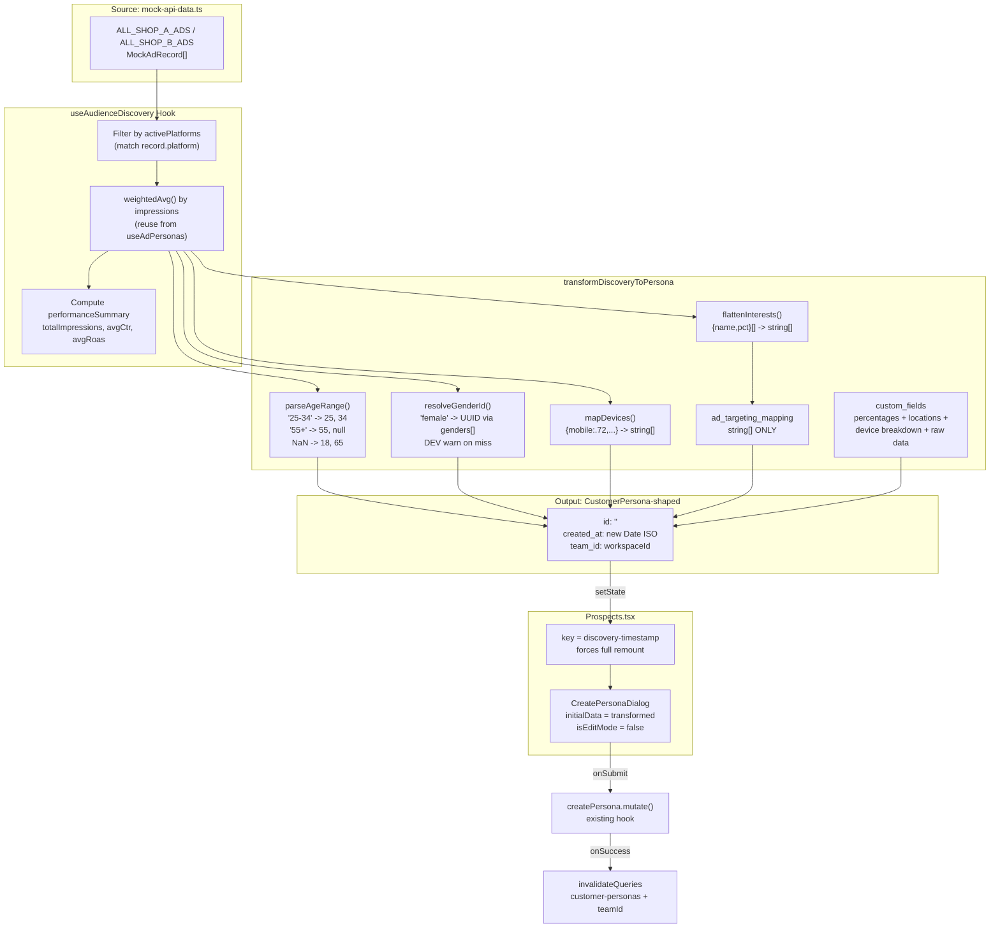

# Audience Discovery Workflow -- FINAL PLAN (v4)

## All Audit Findings -- Status


| #   | Finding                                                                               | Severity | Status                                                                       |
| --- | ------------------------------------------------------------------------------------- | -------- | ---------------------------------------------------------------------------- |
| 1   | `ad_targeting_mapping` only takes `string[]`; `parseAdTargeting()` drops rich objects | CRITICAL | RESOLVED -- flattened strings to targeting, rich data to `custom_fields`     |
| 2   | `gender_id`/`location_id` are FK UUIDs                                                | CRITICAL | RESOLVED -- lowercase match for gender, `location_id: null` always           |
| 3   | "55+" age bucket special handling                                                     | HIGH     | RESOLVED -- `age_min: 55, age_max: null`                                     |
| 4   | No new utility files; export from `mock-api-data.ts`                                  | MEDIUM   | RESOLVED -- all helpers exported from existing file                          |
| 5   | State ownership and cache invalidation                                                | MEDIUM   | RESOLVED -- state in parent, existing mutation handles invalidation          |
| 6   | Dialog state not re-initializing when `discoveryInitialData` changes                  | **RED**  | **RESOLVED** -- `key` prop forces remount; `created_at` = real ISO timestamp |
| 7   | `parseInt` can return `NaN` in `parseAgeRange`                                        | YELLOW   | RESOLVED -- `isNaN` guards with default 18/65                                |
| 8   | Silent failure when gender lookup finds no match                                      | YELLOW   | RESOLVED -- `console.warn` in DEV mode                                       |


---

## Data Pipeline




---

## Step 1: Export Shared Helpers from `mock-api-data.ts`

File: [src/lib/mock-api-data.ts](src/lib/mock-api-data.ts)

**Action**: Move `resolveMockShop` (lines 41-48) and `getMockInsights` (lines 50-55) out of [src/hooks/useAdInsights.tsx](src/hooks/useAdInsights.tsx). Export them from `mock-api-data.ts`. Add `getMockAds`.

Add to `mock-api-data.ts` after the existing `ALL_SHOP_B_ADS` export (line 155):

```typescript
export function resolveMockShop(teamName?: string | null): "shop-a" | "shop-b" {
  if (!teamName) return "shop-a";
  const lower = teamName.toLowerCase();
  if (lower.includes("shop-b") || lower.includes("shopb") || lower.endsWith("-b")) {
    return "shop-b";
  }
  return "shop-a";
}

export function getMockInsights(teamName?: string | null): AdInsightRow[] {
  const shop = resolveMockShop(teamName);
  if (shop === "shop-b") return MOCK_AD_INSIGHTS_SHOP_B;
  return MOCK_AD_INSIGHTS_SHOP_A;
}

export function getMockAds(teamName?: string | null): MockAdRecord[] {
  return resolveMockShop(teamName) === "shop-b" ? ALL_SHOP_B_ADS : ALL_SHOP_A_ADS;
}
```

**Then in [src/hooks/useAdInsights.tsx](src/hooks/useAdInsights.tsx):**

1. DELETE lines 41-55 (local `resolveMockShop` and `getMockInsights` functions).
2. Update the import at line 4-9 to include `getMockInsights`:

```typescript
import {
  USE_MOCK_DATA,
  MOCK_AD_INSIGHTS,
  getMockInsights,        // <-- ADD
} from "@/lib/mock-api-data";
```

1. Remove `MOCK_AD_INSIGHTS_SHOP_A` and `MOCK_AD_INSIGHTS_SHOP_B` from the import since `getMockInsights` now handles the shop resolution internally.

**Verification**: After this change, `useAdInsights.tsx` no longer contains any copy of `resolveMockShop`. The single source of truth is `mock-api-data.ts`.

---

## Step 2: Transformer Functions in `mock-api-data.ts`

All pure functions added to the bottom of [src/lib/mock-api-data.ts](src/lib/mock-api-data.ts). No new files created.

### 2a. `parseAgeRange` -- with NaN guards

```typescript
export function parseAgeRange(
  ageDist: MockPersonaData["age_distribution"],
): { age_min: number; age_max: number | null } {
  const entries = Object.entries(ageDist);
  if (entries.length === 0) return { age_min: 18, age_max: 65 };

  const [range] = entries.sort(([, a], [, b]) => b - a)[0];

  if (range.includes("+")) {
    const min = parseInt(range.replace("+", ""), 10);
    return { age_min: isNaN(min) ? 18 : min, age_max: null };
  }

  const [minStr, maxStr] = range.split("-");
  const parsedMin = parseInt(minStr, 10);
  const parsedMax = parseInt(maxStr, 10);

  return {
    age_min: isNaN(parsedMin) ? 18 : parsedMin,
    age_max: isNaN(parsedMax) ? 65 : parsedMax,
  };
}
```

Every `parseInt` result is guarded. If the mock data somehow contains a non-numeric bucket key, it falls back to 18 (min) or 65 (max) rather than inserting `NaN` into the database.

### 2b. `resolveGenderId` -- with DEV mode warning

```typescript
interface GenderRow { id: string; name_gender: string }

export function resolveGenderId(
  genderDist: MockPersonaData["gender"],
  genderRows: GenderRow[],
): string | null {
  const dominant = Object.entries(genderDist)
    .filter(([k]) => k !== "unknown")
    .sort(([, a], [, b]) => b - a)[0];
  if (!dominant) return null;

  const [genderStr] = dominant;
  const match = genderRows.find(
    (g) => g.name_gender.toLowerCase() === genderStr.toLowerCase(),
  );

  if (!match && import.meta.env.DEV) {
    console.warn(
      `[resolveGenderId] No DB match for gender "${genderStr}". ` +
      `Available: [${genderRows.map((g) => g.name_gender).join(", ")}]. ` +
      `Returning null.`,
    );
  }

  return match?.id ?? null;
}
```

The `import.meta.env.DEV` guard ensures the warning only fires during development. In production builds, Vite tree-shakes this away.

### 2c. `flattenInterests` and `mapDevices` (unchanged)

```typescript
export function flattenInterests(interests: MockPersonaData["interests"]): string[] {
  return [...interests]
    .sort((a, b) => b.pct - a.pct)
    .slice(0, 10)
    .map((i) => i.name);
}

export function mapDevices(deviceType: MockPersonaData["device_type"]): string[] {
  return Object.entries(deviceType)
    .filter(([, pct]) => pct > 0.15)
    .sort(([, a], [, b]) => b - a)
    .map(([name]) => name);
}
```

### 2d. `DiscoveryCustomFields` type + `transformDiscoveryToPersona`

**CRITICAL**: `created_at` is set to a real ISO timestamp (`new Date().toISOString()`), not an empty string. This timestamp is used as the `key` prop on the dialog component to force remount.

```typescript
import type { Json } from "@/integrations/supabase/types";
import type { CustomerPersona } from "@/hooks/useCustomerPersonas";

export interface DiscoveryCustomFields {
  discovery_source: {
    platforms: string[];
    timestamp: string;
  };
  raw_audience: {
    age_distribution: MockPersonaData["age_distribution"];
    gender_distribution: MockPersonaData["gender"];
    interest_details: MockPersonaData["interests"];
    device_distribution: MockPersonaData["device_type"];
    top_locations: MockPersonaData["top_locations"];
  };
  performance: {
    total_impressions: number;
    avg_ctr: number;
    avg_roas: number;
  };
}

export function transformDiscoveryToPersona(
  audienceData: MockPersonaData,
  activePlatforms: string[],
  teamId: string,
  genderRows: GenderRow[],
  performance: { totalImpressions: number; avgCtr: number; avgRoas: number },
): CustomerPersona {
  const { age_min, age_max } = parseAgeRange(audienceData.age_distribution);
  const interestNames = flattenInterests(audienceData.interests);
  const devices = mapDevices(audienceData.device_type);
  const now = new Date().toISOString();

  const hasPlatform = (p: string) => activePlatforms.some((ap) => ap.includes(p));

  // --- ad_targeting_mapping: FLAT string[] ONLY ---
  const adTargeting = {
    facebook: {
      interests: hasPlatform("facebook") ? interestNames : [],
      behaviors: [] as string[],
      custom_audiences: [] as string[],
    },
    google: {
      keywords: [] as string[],
      in_market: hasPlatform("google") ? interestNames : [],
      affinity: [] as string[],
    },
    tiktok: {
      interest_categories: hasPlatform("tiktok") ? interestNames : [],
      behavior_categories: [] as string[],
    },
  };

  // --- custom_fields: RICH data (percentages, locations, distributions) ---
  const customFields: DiscoveryCustomFields = {
    discovery_source: {
      platforms: activePlatforms,
      timestamp: now,
    },
    raw_audience: {
      age_distribution: audienceData.age_distribution,
      gender_distribution: audienceData.gender,
      interest_details: audienceData.interests,
      device_distribution: audienceData.device_type,
      top_locations: audienceData.top_locations,
    },
    performance: {
      total_impressions: performance.totalImpressions,
      avg_ctr: performance.avgCtr,
      avg_roas: performance.avgRoas,
    },
  };

  const topLocation = audienceData.top_locations[0]?.name ?? "N/A";

  return {
    id: "",                   // empty string = dialog treats as CREATE mode
    team_id: teamId,
    persona_name: "",         // user MUST name it
    description:
      `Discovered from ${activePlatforms.join(", ")} audience data. ` +
      `Top location: ${topLocation}. ` +
      `Avg CTR: ${performance.avgCtr.toFixed(2)}%, ROAS: ${performance.avgRoas.toFixed(2)}x.`,
    avatar_url: null,
    gender_id: resolveGenderId(audienceData.gender, genderRows),
    age_min,
    age_max,
    location_id: null,        // always null — raw locations in custom_fields
    profession: null,
    company_size: null,
    salary_range: null,
    industry: null,
    preferred_devices: devices,
    active_hours: null,
    interests: interestNames,
    pain_points: null,
    goals: null,
    custom_fields: customFields as unknown as Json,
    is_active: true,
    is_template: false,
    psychographics: null,
    ad_targeting_mapping: adTargeting as unknown as Json,
    created_at: now,          // REAL timestamp — used as remount key
    updated_at: now,
    created_by: null,
  };
}
```

### Confirmed JSONB Field Split

```
ad_targeting_mapping (parsed by existing parseAdTargeting — string[] only)
├── facebook.interests: string[]         <-- flattenInterests() names
├── facebook.behaviors: string[]         <-- empty
├── facebook.custom_audiences: string[]  <-- empty
├── google.keywords: string[]            <-- empty
├── google.in_market: string[]           <-- flattenInterests() names
├── google.affinity: string[]            <-- empty
├── tiktok.interest_categories: string[] <-- flattenInterests() names
└── tiktok.behavior_categories: string[] <-- empty

custom_fields (freeform JSONB — NO existing parser touches this)
├── discovery_source
│   ├── platforms: string[]              <-- which platforms contributed
│   └── timestamp: string                <-- ISO date of discovery
├── raw_audience
│   ├── age_distribution: {"18-24": 0.32, "25-34": 0.38, ...}
│   ├── gender_distribution: {male: 0.41, female: 0.55, unknown: 0.04}
│   ├── interest_details: [{name: "Fashion & Beauty", pct: 0.58}, ...]
│   ├── device_distribution: {mobile: 0.72, desktop: 0.20, tablet: 0.08}
│   └── top_locations: [{name: "Bangkok", pct: 0.44}, ...]
└── performance
    ├── total_impressions: number
    ├── avg_ctr: number
    └── avg_roas: number
```

`parseAdTargeting()` in `CreatePersonaDialog.tsx` (lines 124-167) safely handles this because every value is a `string[]`. Rich objects with `{name, pct}` are never placed in `ad_targeting_mapping`.

---

## Step 3: Export `weightedAvg` from `useAdPersonas.tsx`

File: [src/hooks/useAdPersonas.tsx](src/hooks/useAdPersonas.tsx)

One-word change at line 22:

```typescript
// BEFORE
function weightedAvg(ads: { persona_data: PersonaData; weight: number }[]): PersonaData | null {

// AFTER
export function weightedAvg(ads: { persona_data: PersonaData; weight: number }[]): PersonaData | null {
```

This allows `useAudienceDiscovery` to reuse the exact same aggregation logic.

---

## Step 4: `useAudienceDiscovery` Hook

File: [src/hooks/useAudienceDiscovery.ts](src/hooks/useAudienceDiscovery.ts) (new)

```typescript
import { useQuery } from "@tanstack/react-query";
import {
  USE_MOCK_DATA,
  getMockAds,
  type MockAdRecord,
} from "@/lib/mock-api-data";
import { weightedAvg, type PersonaData } from "@/hooks/useAdPersonas";

export interface PerformanceSummary {
  totalImpressions: number;
  avgCtr: number;
  avgRoas: number;
}

interface AudienceDiscoveryResult {
  audienceData: PersonaData | null;
  performanceSummary: PerformanceSummary | null;
  filteredAds: MockAdRecord[];
  isLoading: boolean;
  error: Error | null;
}

export function useAudienceDiscovery(
  activePlatforms: string[],
  teamName?: string | null,
): AudienceDiscoveryResult
```

Implementation notes:

- Query key: `["audience-discovery", activePlatforms, USE_MOCK_DATA ? "mock" : "live"]`
- Returns `[]` immediately when `activePlatforms` is empty (same guard as `useAdInsights`)
- Calls `getMockAds(teamName)` then filters by `record.platform`
- Aggregates `persona_data` via `weightedAvg` weighted by `record.impressions`
- Computes `PerformanceSummary` from filtered `MockAdRecord[]`

---

## Step 5: Minimal Changes to `CreatePersonaDialog`

File: [src/components/persona/CreatePersonaDialog.tsx](src/components/persona/CreatePersonaDialog.tsx)

Three small, safe changes:

### 5a. Fix `isEditMode` (line 235)

```typescript
// BEFORE
const isEditMode = !!initialData;

// AFTER
const isEditMode = !!initialData?.id;
```

When the transformer sets `id: ""`, `!!""` evaluates to `false`, so the dialog shows "Create" title and button. Existing edit flows pass a real UUID, so `!!"uuid-here"` remains `true`.

### 5b. Pass `custom_fields` through in `handleSubmit` (line 327-347)

Add one line after `ad_targeting_mapping` in the `data` object:

```typescript
const data: CustomerPersonaInsert = {
  // ... all existing fields unchanged ...
  ad_targeting_mapping: targetingPayload as unknown as Json,
  custom_fields: initialData?.custom_fields ?? null,   // <-- NEW LINE
};
```

For normal create/edit flows `initialData?.custom_fields` is `null` or the previously saved value. For discovery flows it carries the `DiscoveryCustomFields` JSONB. No behavior change for existing paths.

### 5c. Discovery banner (UX)

Add above the `<Tabs>` in the form, after `<DialogHeader>`:

```typescript
{initialData && !initialData.id && (
  <div className="mx-6 mt-4 px-4 py-2 rounded-xl bg-primary/10 text-primary text-sm font-medium">
    Pre-filled from Audience Discovery. Name your persona and review the details.
  </div>
)}
```

---

## Step 6: `AudienceExplorer` Component

File: [src/components/persona/AudienceExplorer.tsx](src/components/persona/AudienceExplorer.tsx) (new)

### Props

```typescript
interface AudienceExplorerProps {
  teamName: string | null;
  onSaveAsPersona: (
    audienceData: PersonaData,
    platforms: string[],
    summary: PerformanceSummary,
  ) => void;
}
```

State is NOT owned here. The parent receives raw data and handles transformation + dialog opening.

### Internal Structure

- **PlatformSelector**: Local `useState<string[]>` for `activePlatforms`. Toggle buttons for `"facebook"`, `"instagram"`, `"tiktok"`, `"google"`, `"shopee"` with platform icons.
- **useAudienceDiscovery**: Called with `activePlatforms` and `teamName`.
- **Charts** (all Recharts, matching patterns in `AdAudienceCharts` at [src/pages/Prospects.tsx](src/pages/Prospects.tsx) lines 412+):
  - Age Distribution: Vertical `BarChart`, age bucket keys, values as percentages
  - Gender Split: `PieChart` donut from `audienceData.gender`
  - Top Interests: Horizontal `BarChart` from `audienceData.interests`, descending
  - Device Breakdown: `PieChart` donut from `audienceData.device_type`
  - Performance KPIs: Three cards -- `totalImpressions`, `avgCtr`, `avgRoas`
- **Save as Persona**: Button disabled when `audienceData` is null. On click calls `onSaveAsPersona(audienceData, activePlatforms, performanceSummary)`.

---

## Step 7: Prospects Page Integration (with forced remount key)

File: [src/pages/Prospects.tsx](src/pages/Prospects.tsx)

### New State and Handler

```typescript
import { transformDiscoveryToPersona, type MockPersonaData } from "@/lib/mock-api-data";
import type { PerformanceSummary } from "@/hooks/useAudienceDiscovery";
import type { PersonaData } from "@/hooks/useAdPersonas";

// Inside the component:
const [discoveryInitialData, setDiscoveryInitialData] =
  useState<CustomerPersona | null>(null);

const handleSaveAsPersona = (
  audienceData: PersonaData,
  platforms: string[],
  summary: PerformanceSummary,
) => {
  const transformed = transformDiscoveryToPersona(
    audienceData as MockPersonaData,
    platforms,
    workspace.id,
    genders ?? [],
    summary,
  );
  setDiscoveryInitialData(transformed);
  setShowCreateDialog(true);
};
```

### New Tab (5th tab)

Add `"discovery"` to the `activeTab` state type: `"cards" | "charts" | "ad-audience" | "insights" | "discovery"`.

```
<TabsTrigger value="discovery" className="rounded-lg gap-2">
  <Sparkles className="h-4 w-4" /> Discovery
</TabsTrigger>

<TabsContent value="discovery">
  <AudienceExplorer
    teamName={workspace.name}
    onSaveAsPersona={handleSaveAsPersona}
  />
</TabsContent>
```

### Dialog Wiring -- with forced remount `key`

This is the **Red Flag Fix**. The `CreatePersonaDialog` uses `useState` initialized from `initialData` in `getDefaultFormData()` which runs on mount. When `discoveryInitialData` changes reference but the component is already mounted, `useState` does NOT reinitialize.

**Solution**: Add a `key` prop that changes whenever new discovery data is provided. This forces React to unmount and remount the component, triggering fresh `useState` initialization.

```typescript
<CreatePersonaDialog
  key={
    discoveryInitialData
      ? `discovery-${discoveryInitialData.created_at}`
      : "create"
  }
  open={showCreateDialog}
  onOpenChange={(open) => {
    setShowCreateDialog(open);
    if (!open) setDiscoveryInitialData(null);
  }}
  onSubmit={(data) =>
    createPersona.mutate(data, {
      onSuccess: () => {
        setShowCreateDialog(false);
        setDiscoveryInitialData(null);
      },
    })
  }
  teamId={workspace.id}
  genders={genders || []}
  isLoading={createPersona.isPending}
  initialData={discoveryInitialData}
  isOwner
/>
```

**Why this works**: `transformDiscoveryToPersona` sets `created_at: new Date().toISOString()`. Each click of "Save as Persona" produces a unique millisecond timestamp. React sees a different `key` and fully remounts the dialog, so `getDefaultFormData()` reads the new `initialData` into fresh `useState`.

When `discoveryInitialData` is `null` (normal create flow), the key is the static string `"create"` -- no unnecessary remounts.

### Existing Edit Dialog (unchanged)

The existing editing dialog further down in the JSX already has its own `open={!!editingPersona}` guard and passes `initialData={editingPersona}`. It is a separate `<CreatePersonaDialog>` instance and is not affected by this change.

### Cache Invalidation -- Confirmed

The `createPersona` mutation in [src/hooks/useCustomerPersonas.tsx](src/hooks/useCustomerPersonas.tsx) lines 152-154 already calls:

```typescript
queryClient.invalidateQueries({ queryKey: ["customer-personas", teamId] });
```

No additional invalidation needed. The `teamId` is guaranteed in the insert payload because `transformDiscoveryToPersona` requires it as a parameter and sets `team_id: teamId` in the output.

---

## Step 8: Persona Comparison Mode

File: [src/components/persona/PersonaInsightsTab.tsx](src/components/persona/PersonaInsightsTab.tsx)

### New State

```typescript
const [comparisonMode, setComparisonMode] = useState(false);
```

Toggle button next to the persona selector: "Compare with Live Data".

### Reading `custom_fields` from Saved Persona

```typescript
const discoveryData = selectedPersona?.custom_fields as DiscoveryCustomFields | null;
const hasDiscoveryData = !!discoveryData?.discovery_source?.platforms;
const sourcePlatforms = discoveryData?.discovery_source?.platforms ?? [];
```

If the persona was created manually (no discovery data), show: "This persona was created manually -- no API comparison available."

### Comparison Layout

Two-column grid when `comparisonMode && hasDiscoveryData`:

- **Left ("Saved Target")**: Persona's `age_min`/`age_max`, gender name, `interests[]`, `preferred_devices[]` from the DB row.
- **Right ("Actual API Data")**: `useAudienceDiscovery(sourcePlatforms)` returns fresh aggregated data. Renders same dimensions.
- **Match indicators**: Per dimension badges:
  - Age: "Match" if API's dominant bucket overlaps persona's min/max
  - Gender: "Match" if API's dominant gender matches persona's `gender_id`
  - Interests: overlap count, e.g. "7/10 interests match"
  - Devices: "Match" if top API device is in persona's `preferred_devices`

---

## Complete File Change Summary


| File                                                                                             | Action | What Changes                                                                                                                                                                                                                                                              |
| ------------------------------------------------------------------------------------------------ | ------ | ------------------------------------------------------------------------------------------------------------------------------------------------------------------------------------------------------------------------------------------------------------------------- |
| [src/lib/mock-api-data.ts](src/lib/mock-api-data.ts)                                             | EDIT   | Export `resolveMockShop`, `getMockInsights`, `getMockAds`; add `parseAgeRange` (NaN guards), `resolveGenderId` (DEV warn), `flattenInterests`, `mapDevices`, `transformDiscoveryToPersona` (`created_at` = real ISO), `DiscoveryCustomFields` type, `GenderRow` interface |
| [src/hooks/useAdInsights.tsx](src/hooks/useAdInsights.tsx)                                       | EDIT   | DELETE local `resolveMockShop` (lines 41-48) and `getMockInsights` (lines 50-55); import `getMockInsights` from `@/lib/mock-api-data`; remove `MOCK_AD_INSIGHTS_SHOP_A`/`_SHOP_B` from imports                                                                            |
| [src/hooks/useAdPersonas.tsx](src/hooks/useAdPersonas.tsx)                                       | EDIT   | Add `export` keyword to `weightedAvg` (line 22)                                                                                                                                                                                                                           |
| [src/hooks/useAudienceDiscovery.ts](src/hooks/useAudienceDiscovery.ts)                           | CREATE | New hook using `getMockAds` + `weightedAvg`; returns `audienceData`, `performanceSummary`, `filteredAds`                                                                                                                                                                  |
| [src/components/persona/CreatePersonaDialog.tsx](src/components/persona/CreatePersonaDialog.tsx) | EDIT   | Line 235: `isEditMode = !!initialData?.id`; line ~347: add `custom_fields` passthrough; add discovery banner JSX                                                                                                                                                          |
| [src/components/persona/AudienceExplorer.tsx](src/components/persona/AudienceExplorer.tsx)       | CREATE | Platform selector + 5 Recharts panels + Save as Persona button                                                                                                                                                                                                            |
| [src/pages/Prospects.tsx](src/pages/Prospects.tsx)                                               | EDIT   | Add `discoveryInitialData` state; add `handleSaveAsPersona`; add Discovery tab; add `key={discovery-timestamp}` to dialog                                                                                                                                                 |
| [src/components/persona/PersonaInsightsTab.tsx](src/components/persona/PersonaInsightsTab.tsx)   | EDIT   | Add comparison mode toggle; two-column layout reading `custom_fields`; match indicator badges                                                                                                                                                                             |


