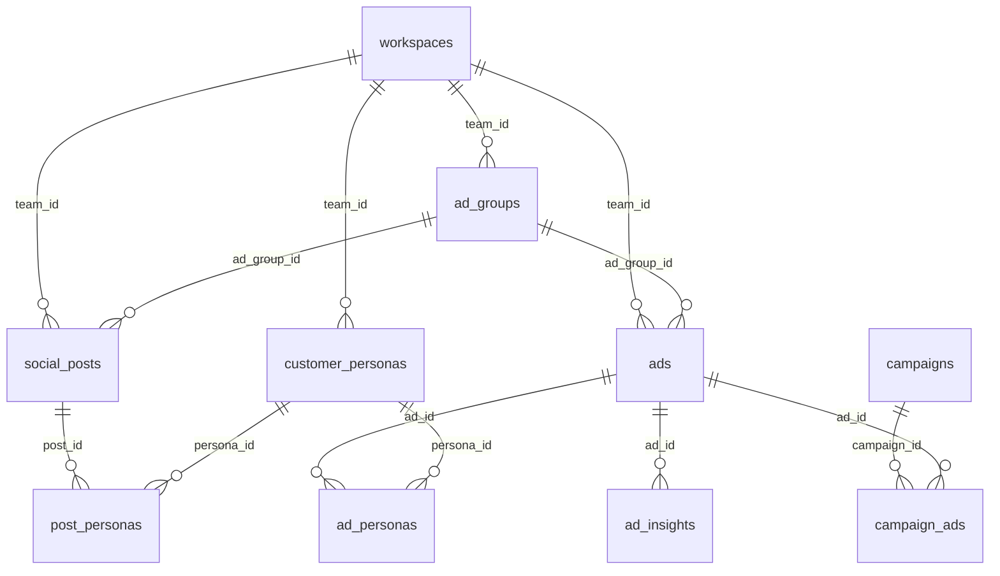

# Marketing Intelligence Suite -- Revised Architectural Plan

## Tech Lead Blockers Addressed

This revision addresses five critical risks identified during review:

- **TL-1 (Creative Type Migration)**: Full 3-step data migration -- add column, backfill, drop old column. The `creative_types` table was dropped in `20260218000003` with CASCADE, orphaning the FK. All existing `creative_type_id` values are either random seeder UUIDs or null. Backfill maps non-null to `'image'` (safe default matching UI behavior), null stays null.
- **TL-2 (Security & Data Leak)**: `is_template` column on `customer_personas`. DB trigger prevents cross-workspace linking in junction tables. Fix the `useCustomerPersonas` hook's `.or(team_id.is.null)` leak.
- **TL-3 (Calendar Performance)**: Composite index `(team_id, scheduled_at)` replaces the single-column index.
- **TL-4 (Persona Cardinality)**: Junction tables (`ad_personas`, `post_personas`) replace single FK. Ads and posts can target multiple personas. Aligns with the multi-audience nature of `persona_data` JSONB already on ads.
- **TL-5 (Types Regeneration)**: Explicit gated step -- `npx supabase gen types typescript` runs after all migrations, blocks all code changes until fresh types compile.

---

## Current State Analysis

Key findings from codebase exploration:

- `**ads.creative_type_id`** ([src/integrations/supabase/types.ts](src/integrations/supabase/types.ts) L356): UUID column. The referenced `creative_types` table was dropped in [20260218000003_drop_unused_tables.sql](supabase/migrations/20260218000003_drop_unused_tables.sql) L33-35 with CASCADE. [AdsList.tsx](src/components/social/analytics/AdsList.tsx) L132 always passes `null` to DB; the UI's string mapping (`"image"`, `"video"`, `"carousel"`) is cosmetic only.
- `**useCustomerPersonas**` ([src/hooks/useCustomerPersonas.tsx](src/hooks/useCustomerPersonas.tsx) L76): Queries `.or(team_id.eq.${teamId},team_id.is.null)`. Since `team_id` is `NOT NULL` in the schema, the null branch is dead code -- but it signals intent for shared/template personas that was never formalized.
- **RLS history**: Original team-scoped policies (L1014 of [consolidated_rls.sql](supabase/migrations/20260218000001_consolidated_rls.sql)) were broken open in [20260305000003](supabase/migrations/20260305000003_open_rls_campaigns_personas.sql) then partially re-locked in [20260306140000](supabase/migrations/20260306140000_fix_campaigns_personas_select_rls.sql). INSERT/UPDATE/DELETE policies are team-scoped via `is_team_member()` / `can_manage_team()` ([20260218232000](supabase/migrations/20260218232000_fix_personas_rls.sql)).
- `**useSocialCalendar`** ([src/hooks/useSocialCalendar.tsx](src/hooks/useSocialCalendar.tsx)): Only queries `social_posts`. No ads appear on the calendar. No index on `(team_id, scheduled_at)` for ads.
- `**campaign_ads` junction** ([20260314002002](supabase/migrations/20260314002002_campaign_kpi_and_ads_junction.sql)): Established pattern for junction tables with composite PK + RLS. We follow this pattern for `ad_personas` and `post_personas`.

---

## Phase 1: Database Migrations

All files go in `supabase/migrations/`. Append-only. Migrations are numbered sequentially and must be applied in order.

### Migration 1: `20260316000001_creative_type_data_migration.sql`

Three-step safe migration for the creative type column. This is the most critical migration -- it must handle the orphaned FK constraint (dropped via CASCADE with `creative_types` table) and backfill before removing the old column.

```sql
-- Step 1: Add the new text column with CHECK constraint
ALTER TABLE public.ads
  ADD COLUMN IF NOT EXISTS creative_type text
  CHECK (creative_type IN ('image', 'video', 'carousel', 'text'));

-- Step 2: Backfill from creative_type_id
-- The creative_types table was dropped in 20260218000003 (CASCADE removed FK).
-- Existing values are either random UUIDs from seeders or NULL.
-- Since there is no mapping table to resolve UUIDs, we default non-null
-- values to 'image' (matches AdsList.tsx default behavior at L185).
UPDATE public.ads
  SET creative_type = 'image'
  WHERE creative_type_id IS NOT NULL
    AND creative_type IS NULL;

-- Step 3: Drop the orphaned UUID column
-- The FK constraint was already dropped by CASCADE in 20260218000003.
-- Use IF EXISTS defensively in case it was manually removed.
ALTER TABLE public.ads
  DROP CONSTRAINT IF EXISTS ads_creative_type_id_fkey;

ALTER TABLE public.ads
  DROP COLUMN IF EXISTS creative_type_id;
```

**Code coordination required**: After this migration, `AdsList.tsx` and `useAds.tsx` must stop referencing `creative_type_id`. The new `creative_type` column is a plain text field -- the UI's existing string IDs (`"image"`, `"video"`, `"carousel"`) map 1:1 without transformation.

### Migration 2: `20260316000002_enhance_ads_table.sql`

Add media, content, and scheduling support. Includes the composite index for calendar performance (TL-3).

```sql
ALTER TABLE public.ads
  ADD COLUMN IF NOT EXISTS media_urls text[] DEFAULT '{}',
  ADD COLUMN IF NOT EXISTS content text,
  ADD COLUMN IF NOT EXISTS scheduled_at timestamptz;

-- TL-3: Composite index for calendar queries (WHERE team_id = ? AND scheduled_at >= ?)
CREATE INDEX IF NOT EXISTS idx_ads_team_scheduled
  ON public.ads(team_id, scheduled_at)
  WHERE scheduled_at IS NOT NULL;
```

### Migration 3: `20260316000003_enhance_customer_personas.sql`

Add `is_template` flag (TL-2), psychographics, and ad targeting mapping.

```sql
-- TL-2: Template personas are readable across workspaces but not editable
ALTER TABLE public.customer_personas
  ADD COLUMN IF NOT EXISTS is_template boolean NOT NULL DEFAULT false,
  ADD COLUMN IF NOT EXISTS psychographics jsonb DEFAULT '{}',
  ADD COLUMN IF NOT EXISTS ad_targeting_mapping jsonb DEFAULT '{}';

CREATE INDEX IF NOT EXISTS idx_personas_is_template
  ON public.customer_personas(is_template)
  WHERE is_template = true;

COMMENT ON COLUMN public.customer_personas.is_template IS
  'When true, persona is a read-only template visible to all workspaces but owned/editable only by the creating workspace.';
COMMENT ON COLUMN public.customer_personas.psychographics IS
  '{ values: [], lifestyle: [], buying_behavior: string, brand_affinity: [], content_preferences: [] }';
COMMENT ON COLUMN public.customer_personas.ad_targeting_mapping IS
  '{ facebook: { interests: [], behaviors: [], custom_audiences: [] }, google: { keywords: [], in_market: [], affinity: [] }, tiktok: { interest_categories: [], behavior_categories: [] } }';
```

### Migration 4: `20260316000004_persona_junction_tables.sql`

Junction tables for multi-persona support (TL-4). Follows the `campaign_ads` pattern from [20260314002002](supabase/migrations/20260314002002_campaign_kpi_and_ads_junction.sql).

```sql
-- ── ad_personas: many-to-many between ads and customer_personas ──
CREATE TABLE IF NOT EXISTS public.ad_personas (
  ad_id       uuid NOT NULL REFERENCES public.ads(id) ON DELETE CASCADE,
  persona_id  uuid NOT NULL REFERENCES public.customer_personas(id) ON DELETE CASCADE,
  assigned_at timestamptz NOT NULL DEFAULT now(),
  PRIMARY KEY (ad_id, persona_id)
);

ALTER TABLE public.ad_personas ENABLE ROW LEVEL SECURITY;

CREATE POLICY "ad_personas_select" ON public.ad_personas
  FOR SELECT TO authenticated
  USING (
    ad_id IN (
      SELECT id FROM public.ads
      WHERE team_id IN (
        SELECT team_id FROM public.workspace_members WHERE user_id = auth.uid()
        UNION
        SELECT id FROM public.workspaces WHERE owner_id = auth.uid()
      )
    )
  );

CREATE POLICY "ad_personas_write" ON public.ad_personas
  FOR ALL TO authenticated
  USING (
    ad_id IN (
      SELECT id FROM public.ads
      WHERE team_id IN (
        SELECT team_id FROM public.workspace_members WHERE user_id = auth.uid()
        UNION
        SELECT id FROM public.workspaces WHERE owner_id = auth.uid()
      )
    )
  );

-- ── post_personas: many-to-many between social_posts and customer_personas ──
CREATE TABLE IF NOT EXISTS public.post_personas (
  post_id     uuid NOT NULL REFERENCES public.social_posts(id) ON DELETE CASCADE,
  persona_id  uuid NOT NULL REFERENCES public.customer_personas(id) ON DELETE CASCADE,
  assigned_at timestamptz NOT NULL DEFAULT now(),
  PRIMARY KEY (post_id, persona_id)
);

ALTER TABLE public.post_personas ENABLE ROW LEVEL SECURITY;

CREATE POLICY "post_personas_select" ON public.post_personas
  FOR SELECT TO authenticated
  USING (
    post_id IN (
      SELECT id FROM public.social_posts
      WHERE team_id IN (
        SELECT team_id FROM public.workspace_members WHERE user_id = auth.uid()
        UNION
        SELECT id FROM public.workspaces WHERE owner_id = auth.uid()
      )
    )
  );

CREATE POLICY "post_personas_write" ON public.post_personas
  FOR ALL TO authenticated
  USING (
    post_id IN (
      SELECT id FROM public.social_posts
      WHERE team_id IN (
        SELECT team_id FROM public.workspace_members WHERE user_id = auth.uid()
        UNION
        SELECT id FROM public.workspaces WHERE owner_id = auth.uid()
      )
    )
  );

GRANT ALL ON public.ad_personas TO authenticated;
GRANT ALL ON public.ad_personas TO service_role;
GRANT ALL ON public.post_personas TO authenticated;
GRANT ALL ON public.post_personas TO service_role;
```

### Migration 5: `20260316000005_cross_workspace_security.sql`

Database-level enforcement preventing cross-workspace persona linking (TL-2). RLS alone cannot prevent a user who belongs to two workspaces from linking Workspace A's persona to Workspace B's ad. A trigger enforces this at the data layer.

```sql
-- ── Trigger function: validate persona belongs to same workspace as content ──
CREATE OR REPLACE FUNCTION public.validate_persona_workspace()
RETURNS trigger AS $$
DECLARE
  v_content_team_id uuid;
  v_persona_team_id uuid;
  v_persona_is_template boolean;
BEGIN
  -- Determine the content's team_id based on the junction table
  IF TG_TABLE_NAME = 'ad_personas' THEN
    SELECT team_id INTO v_content_team_id FROM public.ads WHERE id = NEW.ad_id;
  ELSIF TG_TABLE_NAME = 'post_personas' THEN
    SELECT team_id INTO v_content_team_id FROM public.social_posts WHERE id = NEW.post_id;
  END IF;

  -- Get the persona's team_id and template flag
  SELECT team_id, is_template
    INTO v_persona_team_id, v_persona_is_template
    FROM public.customer_personas
    WHERE id = NEW.persona_id;

  -- Templates can be linked from any workspace; non-templates must match
  IF NOT v_persona_is_template AND v_persona_team_id IS DISTINCT FROM v_content_team_id THEN
    RAISE EXCEPTION 'Cannot link persona from a different workspace (persona team: %, content team: %)',
      v_persona_team_id, v_content_team_id;
  END IF;

  RETURN NEW;
END;
$$ LANGUAGE plpgsql SECURITY DEFINER;

CREATE TRIGGER trg_ad_personas_validate_workspace
  BEFORE INSERT OR UPDATE ON public.ad_personas
  FOR EACH ROW EXECUTE FUNCTION public.validate_persona_workspace();

CREATE TRIGGER trg_post_personas_validate_workspace
  BEFORE INSERT OR UPDATE ON public.post_personas
  FOR EACH ROW EXECUTE FUNCTION public.validate_persona_workspace();

-- ── Update customer_personas SELECT policy to include templates ──
DROP POLICY IF EXISTS "personas_select_policy" ON public.customer_personas;

CREATE POLICY "personas_select_policy" ON public.customer_personas
  FOR SELECT TO authenticated
  USING (
    -- Own workspace personas
    EXISTS (
      SELECT 1 FROM public.workspaces w
      WHERE w.id = customer_personas.team_id
      AND (
        w.owner_id = auth.uid()
        OR EXISTS (
          SELECT 1 FROM public.workspace_members wm
          WHERE wm.team_id = w.id AND wm.user_id = auth.uid()
        )
      )
    )
    -- OR global templates (read-only via this policy)
    OR is_template = true
  );
```

---

## Phase 1.5: Types Regeneration Gate (TL-5)

**CRITICAL**: After all 5 migrations are applied, regenerate Supabase TypeScript types before any code changes. This is a hard gate -- no hook or component work proceeds until types compile.

```bash
npx supabase gen types typescript --project-id "$SUPABASE_PROJECT_REF" --schema public \
  > src/integrations/supabase/types.ts
```

**Verification checklist after regeneration**:

- `ads` type no longer has `creative_type_id`; has `creative_type`, `media_urls`, `content`, `scheduled_at`
- `customer_personas` type has `is_template`, `psychographics`, `ad_targeting_mapping`
- New tables `ad_personas` and `post_personas` appear in the `Tables` union
- Run `npx tsc --noEmit` to catch any compile errors from the removed `creative_type_id`

---

## Phase 2: Entity Relationship (Post-Migration)




Key change from v1: `customer_personas` connects to `ads` and `social_posts` via **junction tables** (`ad_personas`, `post_personas`), not direct FKs. This supports multi-persona targeting per ad/post.

---

## Phase 3: Hook Changes

### 3A. Update `useAds.tsx` ([src/hooks/useAds.tsx](src/hooks/useAds.tsx))

Breaking changes from Migration 1 (creative_type swap):

- Remove `creative_type_id` from `Ad` / `AdInsert` / `AdUpdate` type extensions (the column is dropped).
- Add to `AdWithPublishStatus`: `creative_type`, `media_urls`, `content`, `scheduled_at`.
- Update query to eagerly load linked personas via junction:

```typescript
const { data, error } = await supabase
  .from("ads")
  .select("*, ad_personas(persona_id, customer_personas(id, persona_name, avatar_url))")
  .eq("team_id", workspace.id)
  .order("created_at", { ascending: false });
```

- Update `createAd` mutation to accept `media_urls`, `content`, `scheduled_at`, `creative_type`.
- Add `linkPersonas` / `unlinkPersona` mutations that insert/delete from `ad_personas`.

### 3B. New hook: `useUnifiedCalendar.tsx` ([src/hooks/useUnifiedCalendar.tsx](src/hooks/useUnifiedCalendar.tsx))

Fetches both social_posts and ads for the content calendar. Uses the composite index from TL-3.

```typescript
export interface CalendarItem {
  id: string;
  type: "post" | "ad";
  title: string;
  status: string;
  scheduled_at: string | null;
  published_at: string | null;
  platform_name: string;
  platform_slug: string;
  platform_icon_url: string | null;
  media_urls: string[] | null;
  creative_type: string | null;  // ads only
  persona_names: string[];       // from junction
}

export interface UnifiedCalendarDay {
  date: string;
  items: CalendarItem[];
}
```

Strategy:

- **Query 1** (posts): `social_posts` with `platforms(name, slug, icon_url)`, `post_personas(customer_personas(persona_name))`. Same date filter as current `useSocialCalendar`.
- **Query 2** (ads): `ads` where `scheduled_at IS NOT NULL` and `team_id = workspace.id`, with `ad_personas(customer_personas(persona_name))`. Hits the `idx_ads_team_scheduled` composite index.
- Merge both results client-side into `UnifiedCalendarDay[]`, sorted by date.
- Return `{ calendarDays, isLoading, error }`.
- `useSocialCalendar` remains functional for backward compat.

### 3C. Update `useCustomerPersonas.tsx` ([src/hooks/useCustomerPersonas.tsx](src/hooks/useCustomerPersonas.tsx))

**Security fix (TL-2)**:

```typescript
// BEFORE (line 76 -- leaks via dead .is.null branch):
.or(`team_id.eq.${teamId},team_id.is.null`)

// AFTER -- properly scoped with template support:
.or(`team_id.eq.${teamId},is_template.eq.true`)
```

Additional changes:

- Add `is_template`, `psychographics`, `ad_targeting_mapping` to `CustomerPersona` interface.
- Add these fields to `CustomerPersonaInsert` / `createPersona` / `updatePersona`.
- Remove `console.log` on line 72 (violates no-console rule).

### 3D. New hook: `usePersonaInsights.tsx` ([src/hooks/usePersonaInsights.tsx](src/hooks/usePersonaInsights.tsx))

Aggregates `ad_insights` for ads linked to a persona via the `ad_personas` junction.

```typescript
export function usePersonaInsights(personaId: string | undefined) {
  // 1. Fetch ad_personas WHERE persona_id = personaId -> get ad_id list
  // 2. Fetch ad_insights WHERE ad_id IN (ad_id list)
  // 3. Aggregate: impressions, clicks, spend, conversions, CTR, ROAS
  // 4. Group by date for daily chart data
  // 5. Return { summary, dailyData, linkedAds, isLoading, error }
}
```

### 3E. New hook: `useAdPersonas.tsx` / `usePostPersonas.tsx`

Thin wrappers for managing junction table rows:

```typescript
export function useAdPersonaLinks(adId: string) {
  // query: ad_personas WHERE ad_id = adId, joined with customer_personas
  // mutations: linkPersona(personaId), unlinkPersona(personaId)
}

export function usePostPersonaLinks(postId: string) {
  // query: post_personas WHERE post_id = postId, joined with customer_personas
  // mutations: linkPersona(personaId), unlinkPersona(personaId)
}
```

---

## Phase 4: Component Changes

### 4A. AdsList.tsx Refactor ([src/components/social/analytics/AdsList.tsx](src/components/social/analytics/AdsList.tsx))

**Critical fix for TL-1**: Replace all `creative_type_id` references with `creative_type`.

Specific line changes:

- L110: `creative_type_id: "image"` --> `creative_type: "image"`
- L121: same in `resetForm`
- L132: `creative_type_id: null` --> `creative_type: formData.creative_type`
- L153: same in `handleEdit`
- L185: `creative_type_id: "image"` --> `creative_type: ad.creative_type || "image"`
- L300, L679, L740: `ad.creative_type_id` --> `ad.creative_type`
- L237 `getCreativeType`: Accept `string | null` (no longer UUID)
- L474-477, L592-595: Form field name changes

Extract the Add/Edit dialog into `**AdFormDialog.tsx`** with:

- Media URL input list + thumbnail previews (populates `media_urls[]`)
- Content `Textarea` (populates `content`)
- Date/time picker (populates `scheduled_at`)
- **Multi-select** `PersonaSelector` (manages `ad_personas` junction)
- `creative_type` Select (direct text values: `image`, `video`, `carousel`, `text`)

### 4B. "Create Ad" from Ad Groups ([src/components/social/analytics/AdGroupsList.tsx](src/components/social/analytics/AdGroupsList.tsx))

- Add a `<Button>` with `Plus` icon inside each Ad Group card, labeled "Create Ad".
- On click, open `AdFormDialog` with `ad_group_id` pre-filled.
- Reuses the shared `AdFormDialog` component.

### 4C. Unified Content Calendar ([src/components/social/planner/ContentCalendar.tsx](src/components/social/planner/ContentCalendar.tsx))

- Accept `UnifiedCalendarDay[]` (new type) instead of `CalendarDay[]`.
- Update or extend `ScheduledPostCard` to handle `CalendarItem`:
  - **Posts**: Existing blue/platform-colored styling, platform icon.
  - **Ads**: Amber/orange left-border accent, small "Ad" badge, creative_type icon.
- Add filter row in calendar header: segmented control for "All" / "Posts" / "Ads".

### 4D. PersonaSelector Component ([src/components/persona/PersonaSelector.tsx](src/components/persona/PersonaSelector.tsx))

Reusable **multi-select** combobox:

- Props: `selectedIds: string[]`, `onChange: (ids: string[]) => void`, `teamId: string`.
- Internally calls `useCustomerPersonas(teamId)` to load own-workspace + template personas.
- Renders persona name + avatar; template personas have a badge indicator.
- **Workspace boundary enforced**: Only shows personas where `team_id = teamId OR is_template = true`.
- Used by `AdFormDialog`, `PostComposer`, and `PersonaInsightsTab`.

### 4E. Enhanced Persona Studio ([src/components/persona/CreatePersonaDialog.tsx](src/components/persona/CreatePersonaDialog.tsx))

Evolve into a multi-section form with tabs/accordion:

- **Section 1 -- Basic Info** (existing): Name, gender, description.
- **Section 2 -- Demographics** (existing): Age range, profession, industry, company size, salary.
- **Section 3 -- Psychographics** (new): Stored in `psychographics` JSONB.
  - Values (tag input)
  - Lifestyle (tag input)
  - Buying behavior (select: impulse / research-heavy / deal-seeker / brand-loyal)
  - Brand affinity (tag input)
  - Content preferences (tag input)
- **Section 4 -- Behavioral** (existing): Devices, active hours, interests, goals, pain points.
- **Section 5 -- Ad Targeting Mapping** (new): Stored in `ad_targeting_mapping` JSONB.
  - Platform tabs: Facebook/Instagram, Google, TikTok
  - Per platform: interest targeting (tags), behavior targeting (tags), custom audiences (tags)
- **Section 6 -- Settings** (new): `is_template` toggle (only visible to workspace owners).

### 4F. PersonaInsightsTab ([src/components/persona/PersonaInsightsTab.tsx](src/components/persona/PersonaInsightsTab.tsx))

New tab on the `/personas` page:

- Persona picker dropdown at top (using `PersonaSelector` in single-select mode).
- KPI cards: Impressions, Clicks, CTR, Spend, Conversions, ROAS.
- Daily performance line chart (recharts Line -- impressions + clicks over time).
- Linked ads table: ad name, creative_type, status, platform, individual metrics.

---

## Phase 5: Component Hierarchy

### `/personas` Page (enhanced [Prospects.tsx](src/pages/Prospects.tsx))

```
Prospects (page)
  +-- KPI StatCards
  +-- Tabs
  |   +-- "Analytics" tab (existing demographics charts)
  |   +-- "Gallery" tab (PersonaCard grid)
  |   |     +-- PersonaCard (existing)
  |   +-- "Ad Audience" tab (existing platform audience data)
  |   +-- "Insights" tab (NEW)
  |         +-- PersonaInsightsTab
  |               +-- PersonaSelector (single-select mode)
  |               +-- KPI row
  |               +-- DailyPerformanceChart
  |               +-- LinkedAdsTable
  +-- CreatePersonaDialog (enhanced: Psychographics + Ad Targeting + is_template)
```

### `/social/planner` Page (enhanced [SocialPlanner.tsx](src/pages/social/SocialPlanner.tsx))

```
SocialPlanner (page)
  +-- useUnifiedCalendar (replaces useSocialCalendar)
  +-- ContentCalendar
  |     +-- Filter toggle (All / Posts / Ads)
  |     +-- CalendarItemCard (post variant / ad variant)
  +-- PostComposer (+ PersonaSelector multi-select)
  +-- SocialPostsList
```

### `/social/analytics` Page (enhanced [SocialAnalyticsView.tsx](src/pages/social/SocialAnalyticsView.tsx))

```
SocialAnalyticsView (page)
  +-- AdGroupsList
  |     +-- AdGroupCard
  |           +-- "Create Ad" button --> AdFormDialog(ad_group_id=X)
  |           +-- LinkItemsDialog (existing)
  +-- AdsList
  |     +-- AdFormDialog (extracted, shared)
  |           +-- Media URL inputs + previews
  |           +-- Content textarea
  |           +-- DateTimePicker (scheduled_at)
  |           +-- PersonaSelector (multi-select)
  |           +-- creative_type Select (text enum)
  +-- AdInsightsSummary (existing)
```

---

## Phase 6: Data Flow

```mermaid
flowchart TD
    subgraph DB [Database Layer]
        ADS[ads]
        SP[social_posts]
        CP[customer_personas]
        AP[ad_personas junction]
        PP[post_personas junction]
        AI[ad_insights]
        CA[campaign_ads]
        TRG["validate_persona_workspace trigger"]
    end

    subgraph Hooks [React Query Hooks]
        useAds_h[useAds]
        useUC[useUnifiedCalendar]
        useCP_h[useCustomerPersonas]
        usePI[usePersonaInsights]
        useAPL[useAdPersonaLinks]
        usePPL[usePostPersonaLinks]
    end

    subgraph UI [Components]
        Calendar[ContentCalendar]
        AdForm[AdFormDialog]
        PersonaSel[PersonaSelector]
        PersonaStudio[CreatePersonaDialog]
        PInsights[PersonaInsightsTab]
    end

    ADS --> useAds_h
    AP --> useAds_h
    SP --> useUC
    ADS --> useUC
    AP --> useUC
    PP --> useUC
    CP --> useCP_h
    AP --> usePI
    AI --> usePI
    AP --> useAPL
    PP --> usePPL
    TRG -.->|validates| AP
    TRG -.->|validates| PP

    useUC --> Calendar
    useAds_h --> AdForm
    useAPL --> AdForm
    useCP_h --> PersonaSel
    useCP_h --> PersonaStudio
    usePI --> PInsights
    PersonaSel --> AdForm
end
```


---

## Phase 7: Implementation Order (PR Sequence)

Strict dependency chain. Each PR is independently reviewable and deployable.

**PR 1 -- Database Migrations + Type Regen**

- Apply migrations 1-5 in order.
- Run `npx supabase gen types typescript` to regenerate [src/integrations/supabase/types.ts](src/integrations/supabase/types.ts).
- Run `npx tsc --noEmit` to verify no compile errors from removed `creative_type_id`.
- **This PR is the gate** -- nothing else merges until this is green.

**PR 2 -- Hook Layer**

- Update [useAds.tsx](src/hooks/useAds.tsx): swap `creative_type_id` for `creative_type`, add new columns, join `ad_personas`.
- Update [useCustomerPersonas.tsx](src/hooks/useCustomerPersonas.tsx): fix `.or()` security leak, add `is_template`/`psychographics`/`ad_targeting_mapping`.
- Create `useUnifiedCalendar.tsx`, `usePersonaInsights.tsx`, `useAdPersonaLinks.tsx`, `usePostPersonaLinks.tsx`.

**PR 3 -- Shared Components**

- Create `PersonaSelector.tsx` (multi-select, workspace-scoped + templates).
- Extract `AdFormDialog.tsx` from [AdsList.tsx](src/components/social/analytics/AdsList.tsx).

**PR 4 -- Ad Enhancements**

- Refactor [AdsList.tsx](src/components/social/analytics/AdsList.tsx) to use `AdFormDialog`, swap all `creative_type_id` refs.
- Add "Create Ad" button to [AdGroupsList.tsx](src/components/social/analytics/AdGroupsList.tsx).

**PR 5 -- Unified Calendar**

- Update [ContentCalendar.tsx](src/components/social/planner/ContentCalendar.tsx) + [ScheduledPostCard.tsx](src/components/social/planner/ScheduledPostCard.tsx) for unified items.
- Update [SocialPlanner.tsx](src/pages/social/SocialPlanner.tsx) to use `useUnifiedCalendar`, add filter toggle.

**PR 6 -- Persona Studio**

- Enhance [CreatePersonaDialog.tsx](src/components/persona/CreatePersonaDialog.tsx) with Psychographics, Ad Targeting Mapping, and `is_template` toggle.

**PR 7 -- Persona Insights**

- Create `PersonaInsightsTab.tsx`.
- Add "Insights" tab to [Prospects.tsx](src/pages/Prospects.tsx).

---

## Key Design Decisions (Updated)

- **Junction tables over single FK (TL-4)**: An ad can target multiple personas (e.g., "Young Professionals" + "Budget Shoppers"). This mirrors real-world multi-audience ad sets. Junction tables (`ad_personas`, `post_personas`) follow the existing `campaign_ads` pattern. The existing `persona_data` JSONB on ads is kept for platform-sourced audience data -- a separate concern from internal targeting personas.
- `**is_template` + trigger for security (TL-2)**: Templates are globally readable but only editable by the owning workspace. The `validate_persona_workspace` trigger enforces same-workspace at the data layer, preventing cross-workspace linking even for users who belong to multiple workspaces. RLS alone is insufficient for this case.
- **3-step creative_type migration (TL-1)**: Add -> backfill -> drop is the only safe approach. We cannot rename a UUID column to text. The FK was already orphaned by the CASCADE drop of `creative_types`, so we just clean up defensively.
- **Composite index (TL-3)**: `(team_id, scheduled_at)` is optimal for the unified calendar query pattern `WHERE team_id = ? AND scheduled_at >= ?`. A partial index `WHERE scheduled_at IS NOT NULL` further reduces index size since most ads won't be scheduled.
- **Types gate (TL-5)**: Regenerated types are a hard prerequisite for all subsequent work. The removed `creative_type_id` column will cause compile errors in `useAds.tsx` and `AdsList.tsx` that must be fixed in the same PR as the type regen.

---

## Files to Create

- `supabase/migrations/20260316000001_creative_type_data_migration.sql`
- `supabase/migrations/20260316000002_enhance_ads_table.sql`
- `supabase/migrations/20260316000003_enhance_customer_personas.sql`
- `supabase/migrations/20260316000004_persona_junction_tables.sql`
- `supabase/migrations/20260316000005_cross_workspace_security.sql`
- `src/hooks/useUnifiedCalendar.tsx`
- `src/hooks/usePersonaInsights.tsx`
- `src/hooks/useAdPersonaLinks.tsx`
- `src/hooks/usePostPersonaLinks.tsx`
- `src/components/persona/PersonaSelector.tsx`
- `src/components/social/analytics/AdFormDialog.tsx`
- `src/components/persona/PersonaInsightsTab.tsx`

## Files to Modify

- `src/integrations/supabase/types.ts` -- regenerated (not hand-edited)
- `src/hooks/useAds.tsx` -- swap creative_type_id, add new columns, join ad_personas
- `src/hooks/useCustomerPersonas.tsx` -- fix .or() leak, add is_template + psychographics + ad_targeting_mapping
- `src/components/social/analytics/AdsList.tsx` -- swap creative_type_id, use AdFormDialog
- `src/components/social/analytics/AdGroupsList.tsx` -- add "Create Ad" per group
- `src/components/social/planner/ContentCalendar.tsx` -- accept unified items, ad variant rendering
- `src/components/social/planner/ScheduledPostCard.tsx` -- support CalendarItem type
- `src/components/persona/CreatePersonaDialog.tsx` -- Psychographics + Ad Targeting + is_template
- `src/pages/Prospects.tsx` -- add "Insights" tab
- `src/pages/social/SocialPlanner.tsx` -- switch to useUnifiedCalendar

