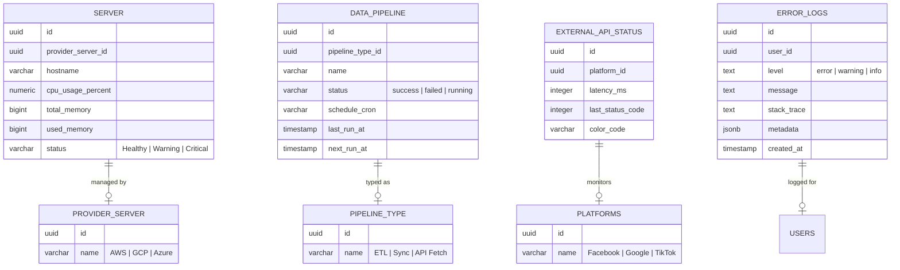

# Database Mapping: Monitor Real-time System Health (`/dev/monitor`)

เอกสารฉบับนี้อธิบายรายละเอียดเกี่ยวกับโครงสร้างฐานข้อมูล (Database Schema) และความสัมพันธ์ของตารางต่างๆ ที่ใช้ในหน้า **Monitor System Health** เพื่อให้ทีม Developer เข้าใจที่มาของข้อมูลและการเชื่อมโยงข้อมูลในแต่ละส่วน

---

## 1. ข้อมูลภาพรวม (Overall Metrics)
ข้อมูลในส่วนของ Dashboard Summary (CPU, Memory, Disk โดยรวม) จะดึงมาจากตาราง `server` และผ่านการคำนวณในระดับ Application (Frontend Hook: `usePerformanceMetrics`)

---

## 2. รายละเอียดแยกตาม Tab ในหน้าจอ

### **Tab 1: Servers (สุขภาพของเซิร์ฟเวอร์)**
ใช้ติดตามสถานะทรัพยากร (Resources) ของเครื่องแม่ข่ายแต่ละเครื่อง

| ตารางหลัก (Source) | ตารางที่เชื่อมโยง (JOIN) | ความสัมพันธ์ (Relationship) | จุดประสงค์ (Purpose) |
| :--- | :--- | :--- | :--- |
| `server` | `provider_server` | `server.provider_server_id` $\rightarrow$ `provider_server.id` | เพื่อระบุ Vendor ผู้ให้บริการ (เช่น AWS, GCP) และข้อมูลพื้นฐานของเครื่อง |

**ข้อมูลสำคัญ:**
- `cpu_usage_percent`: เปอร์เซ็นต์การใช้งาน CPU
- `total_memory` / `used_memory`: ข้อมูลการใช้ RAM
- `disk_total` / `disk_used`: ข้อมูลพื้นที่จัดเก็บ
- `status`: สถานะที่คำนวณแล้ว (Healthy, Warning, Critical) โดยอาศัยระดับการใช้งานทรัพยากร

---

### **Tab 2: Data Pipelines (ท่อส่งข้อมูล)**
ใช้ติดตามการทำงานของกระบวนการเบื้องหลัง (Backend Jobs / Cron Tasks)

| ตารางหลัก (Source) | ตารางที่เชื่อมโยง (JOIN) | ความสัมพันธ์ (Relationship) | จุดประสงค์ (Purpose) |
| :--- | :--- | :--- | :--- |
| `data_pipeline` | `pipeline_type` | `data_pipeline.pipeline_type_id` $\rightarrow$ `pipeline_type.id` | เพื่อจัดกลุ่มประเภทของท่อส่งข้อมูล (เช่น Sync Data, Analytical Process) |

**ข้อมูลสำคัญ:**
- `schedule_cron`: รูปแบบเวลาการทำงาน (Cron Expression)
- `last_run_at`: เวลาที่ทำงานครั้งล่าสุด
- `next_run_at`: เวลาที่จะทำงานครั้งต่อไป
- `status`: สถานะการทำงานล่าสุด (e.g., success, failed, running)

---

### **Tab 3: Errors (ประวัติข้อผิดพลาด)**
ใช้สำหรับเฝ้าระวังและวินิจฉัยปัญหาที่เกิดขึ้นกับผู้ใช้หรือระบบ

| ตารางหลัก (Source) | ตารางที่เชื่อมโยง (JOIN) | ความสัมพันธ์ (Relationship) | จุดประสงค์ (Purpose) |
| :--- | :--- | :--- | :--- |
| `error_logs` | `auth.users` | `error_logs.user_id` $\rightarrow$ `auth.users.id` | เพื่อระบุว่า Error นั้นๆ เกิดขึ้นกับผู้ใช้บัญชีใด เพื่อความสะดวกในการ Support |

**ข้อมูลสำคัญ:**
- `level`: ระดับความรุนแรง (Error, Warning, Info)
- `message`: ข้อความแสดงข้อผิดพลาด
- `stack_trace`: รายละเอียดทางเทคนิคสำหรับการ Debug
- `metadata`: ข้อมูลเพิ่มเติมอื่นๆ เช่น Browser, Page URL ขณะเกิดปัญหา

---

### **Tab 4: External APIs (สถานะ API ภายนอก)**
ใช้ตรวจสอบความเสถียรของการเชื่อมต่อกับบริการ Third-party

| ตารางหลัก (Source) | ตารางที่เชื่อมโยง (JOIN) | ความสัมพันธ์ (Relationship) | จุดประสงค์ (Purpose) |
| :--- | :--- | :--- | :--- |
| `external_api_status` | `platforms` | `external_api_status.platform_id` $\rightarrow$ `platforms.id` | เพื่อระบุชื่อ Platform ที่เชื่อมต่อ (เช่น Facebook Ads API, Google API) |

**ข้อมูลสำคัญ:**
- `latency_ms`: ความเร็วในการตอบสนอง (Latency)
- `last_status_code`: HTTP Status Code ล่าสุด (เช่น 200, 401, 500)
- `color_code`: สีที่แสดงสถานะ (เขียว, ส้ม, แดง)

---

## 3. Entity-Relationship Diagram (ERD)

---

## 4. หมายเหตุเพิ่มเติม
- ข้อมูลทั้งหมดในหน้านี้รองรับการทำงานแบบ **Real-time** ผ่าน Supabase Realtime โดยอาศัยการฟัง Event จากตาราง `server`, `data_pipeline`, และ `error_logs` โดยตรง
- การ JOIN ข้อมูลจะทำผ่าน Supabase Client (Frontend Hooks) โดยมีการใช้คำสั่ง `.select('*, related_table:related_column(name)')` เพื่อดึงข้อมูลตารางที่เกี่ยวข้องกันมาแสดงผลพร้อมกัน
