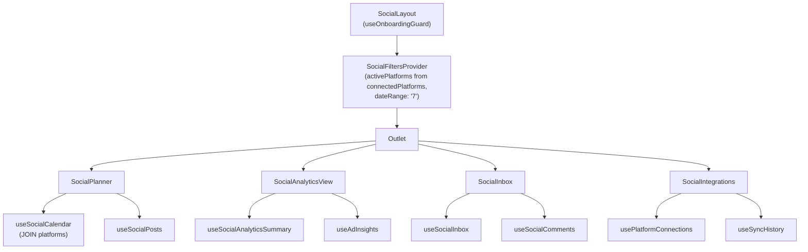

# Social Analytics Dashboard Architecture (Rev 2 -- Tech Lead Fixes Applied)

## 0. `.cursorrules` Alignment Review

The rules are broadly aligned with the stack. Two observations:

- **Component syntax inconsistency**: Rules prescribe `const Foo: React.FC<Props> = () => {}`, but 90%+ of the codebase uses `export function Foo(props: Props) {}`. The plan follows the **actual codebase convention** (named function exports). Consider updating the rule to match reality.
- **No `any` rule**: The existing `MetricRow` helper in [src/pages/SocialAnalytics.tsx](src/pages/SocialAnalytics.tsx) uses `any` for props -- this will be fixed in the refactor with a proper `MetricRowProps` interface.

Everything else (Tailwind-only styling, shadcn primitives, React Query hooks, `@/` imports, Supabase via `client.ts`, RLS via `is_team_member()`, append-only migrations) is followed throughout.

---

## 1. Routing Strategy -- Nested Routes Under `/social/`*

Replace the single `/social-analytics` route with a layout route and 4 child routes:

```
/social              --> redirect to /social/planner
/social/planner      --> Planner view
/social/analytics    --> Analytics view
/social/inbox        --> Inbox view
/social/integrations --> Integrations view
```

In [src/App.tsx](src/App.tsx), inside the `CustomerProtectedRoute` + `MainLayout` block:

```tsx
<Route path="/social" element={<SocialLayout />}>
  <Route index element={<Navigate to="planner" replace />} />
  <Route path="planner" element={<SocialPlanner />} />
  <Route path="analytics" element={<SocialAnalyticsView />} />
  <Route path="inbox" element={<SocialInbox />} />
  <Route path="integrations" element={<SocialIntegrations />} />
</Route>
```

The old `/social-analytics` route becomes a redirect to `/social/analytics` for backward compatibility. Update the sidebar link in [src/components/layout/AppSidebar.tsx](src/components/layout/AppSidebar.tsx) from `/social-analytics` to `/social`.

---

## 2. Directory and File Structure

```
src/
  pages/
    social/                          <-- NEW directory for route-level pages
      SocialLayout.tsx               <-- Shared shell: onboarding guard, header, tab nav, context, Outlet
      SocialPlanner.tsx              <-- /social/planner page
      SocialAnalyticsView.tsx        <-- /social/analytics page
      SocialInbox.tsx                <-- /social/inbox page
      SocialIntegrations.tsx         <-- /social/integrations page
    SocialAnalytics.tsx              <-- KEEP temporarily, redirect to /social/analytics

  components/
    social/                          <-- Existing dir, expanded
      layout/
        SocialTabNav.tsx             <-- Tab navigation strip (shared across views)
        PlatformFilterBar.tsx        <-- Platform toggle bar (extracted from current page)
        DateRangeSelector.tsx        <-- Date range picker (extracted)
      planner/
        ContentCalendar.tsx          <-- Calendar grid view
        PostComposer.tsx             <-- Create/edit post dialog (deep extraction -- see Section 3f)
        ScheduledPostCard.tsx        <-- Single scheduled post card
        PlatformPublishSelector.tsx  <-- Multi-platform target picker
      analytics/
        AnalyticsOverview.tsx        <-- KPI stat cards row
        PerformanceChart.tsx         <-- Impressions/clicks area chart (extracted from AdInsightsSummary)
        SpendConversionsChart.tsx    <-- Spend bar chart (extracted from AdInsightsSummary)
        PostComparisonDialog.tsx     <-- Compare dialog (extracted from SocialAnalytics.tsx)
        PlatformBreakdownTable.tsx   <-- Per-platform metrics table (new)
        AdsList.tsx                  <-- EXISTING, moved from components/social/
        AdGroupsList.tsx             <-- EXISTING, moved from components/social/
        AdInsightsSummary.tsx        <-- EXISTING, moved from components/social/
      inbox/
        ConversationList.tsx         <-- Left panel: list of threads
        ConversationThread.tsx       <-- Right panel: message thread
        ReplyComposer.tsx            <-- Reply input box
        InboxFilters.tsx             <-- Platform/status/date filters
      integrations/
        PlatformConnectionCard.tsx   <-- Single platform card (connect/disconnect)
        ConnectionStatusBadge.tsx    <-- Status indicator
        ApiKeyDialog.tsx             <-- API key input dialog
        SyncHistoryTable.tsx         <-- Sync log table

      SocialPostsList.tsx            <-- EXISTING, refactored (see Section 3f)

  contexts/
    SocialFiltersContext.tsx          <-- NEW: shared cross-tab filter state

  hooks/
    useSocialPosts.tsx               <-- EXISTING (no changes)
    useSocialComments.tsx            <-- NEW: CRUD for social_comments table
    useSocialInbox.tsx               <-- NEW: aggregated inbox threads with realtime
    useSocialCalendar.tsx            <-- NEW: calendar-view query with platforms JOIN
    useSocialAnalyticsSummary.tsx    <-- NEW: cross-platform rollup metrics
    useSyncHistory.tsx               <-- NEW: query for sync_history table
    useAdInsights.tsx                <-- EXISTING (no changes)
    usePlatformConnections.tsx       <-- EXISTING (no changes)
```

---

## 3. Component Hierarchy

### 3a. SocialLayout (shared shell) -- with Onboarding Guard

**FIX (Blocker 3):** `useOnboardingGuard` is called at the `SocialLayout` level. If the user is not onboarded, the entire `/social/`* subtree renders `<OnboardingBanner>` and the `<Outlet>` is not mounted. This matches the pattern in the existing [src/pages/SocialAnalytics.tsx](src/pages/SocialAnalytics.tsx) lines 107-109.

```
SocialLayout
  +-- useOnboardingGuard() --> if state !== "ready", render <OnboardingBanner> and STOP
  +-- <SocialFiltersProvider>         (see Section 4)
  |     +-- Header (title + global actions)
  |     +-- SocialTabNav (Planner | Analytics | Inbox | Integrations)
  |     +-- <Outlet />  (renders active child route)
  +-- </SocialFiltersProvider>
```

`SocialLayout` owns zero tab-specific state. The `SocialTabNav` renders the Radix `Tabs` component with `value` derived from `useLocation().pathname` and `onValueChange` calling `navigate()`. This keeps the tab strip purely navigational.

Pseudocode for the guard:

```tsx
export default function SocialLayout() {
  const { state: onboardingState } = useOnboardingGuard();

  if (onboardingState !== "ready") {
    return <OnboardingBanner state={onboardingState} />;
  }

  return (
    <SocialFiltersProvider>
      <div className="...">
        <Header />
        <SocialTabNav />
        <Outlet />
      </div>
    </SocialFiltersProvider>
  );
}
```

### 3b. Planner Tab

```
SocialPlanner
  +-- PlatformFilterBar (reads from SocialFiltersContext)
  +-- DateRangeSelector (reads from SocialFiltersContext)
  +-- ContentCalendar
  |     +-- ScheduledPostCard (per cell)
  +-- PostComposer (dialog, triggered by "New Post" or clicking a calendar slot)
  |     +-- PlatformPublishSelector
  +-- SocialPostsList (existing, filtered to draft/scheduled, reads context)
```

Data: `useSocialCalendar(dateRange)` returns posts grouped by `scheduled_at` date. The hook performs a JOIN with the `platforms` table to resolve `platform_name` (see Section 5 for details). `useSocialPosts` mutations handle create/update/delete.

### 3c. Analytics Tab

```
SocialAnalyticsView
  +-- PlatformFilterBar (reads from SocialFiltersContext)
  +-- DateRangeSelector (reads from SocialFiltersContext)
  +-- AnalyticsOverview (stat cards)
  +-- PerformanceChart (impressions/clicks area chart)
  +-- SpendConversionsChart (spend/conversions bar chart)
  +-- PlatformBreakdownTable
  +-- PostComparisonDialog (triggered by selecting posts)
  +-- Tabs (sub-tabs for Ads / Ad Groups detail)
  |     +-- AdsList
  |     +-- AdGroupsList
```

Data: `useSocialAnalyticsSummary(dateRange, activePlatforms)` combines `useAdInsights` + `useSocialPosts` to produce unified cross-platform metrics. Existing `AdInsightsSummary` chart components are extracted into `PerformanceChart` and `SpendConversionsChart` for reuse.

### 3d. Inbox Tab

```
SocialInbox
  +-- InboxFilters (platform, read/unread, sentiment, search)
  +-- split layout (sidebar + main)
  |   +-- ConversationList (left)
  |   |     +-- ConversationListItem (per thread)
  |   +-- ConversationThread (right)
  |         +-- CommentBubble (per message)
  |         +-- ReplyComposer
```

Data: `useSocialInbox(filters)` fetches from the new `social_comments` table, grouped by `post_id` into threads. Supabase Realtime subscription on `social_comments` for live updates.

### 3e. Integrations Tab

```
SocialIntegrations
  +-- PlatformConnectionCard (per platform, includes all platforms not just connected)
  |     +-- ConnectionStatusBadge
  |     +-- Connect / Disconnect / Refresh actions
  |     +-- ApiKeyDialog (on connect)
  +-- SyncHistoryTable (backed by sync_history table)
```

Data: Reuses `usePlatformConnections()` context for platform CRUD. New `useSyncHistory(teamId)` hook queries the `sync_history` table for the log display.

### 3f. PostComposer Extraction -- Deep State Split (not a simple file move)

**Acknowledged complexity:** Extracting `PostComposer` from [src/components/social/SocialPostsList.tsx](src/components/social/SocialPostsList.tsx) is a **deep state refactor**, not a file move. The current `SocialPostsList` co-locates:

- Form state (`formData`, `resetForm`)
- Dialog open/close state (`addDialogOpen`, `editDialogOpen`, `selectedPost`)
- Mutation calls (`createPost.mutate`, `updatePost.mutate`)
- Two duplicated dialog JSX blocks (add + edit)

**Refactoring strategy:**

1. `**PostComposer`** becomes a standalone dialog component that receives:

```tsx
interface PostComposerProps {
  mode: "create" | "edit";
  open: boolean;
  onOpenChange: (open: boolean) => void;
  initialData?: Partial<SocialPostFormData>;
  onSubmit: (data: SocialPostFormData) => void;
  isPending: boolean;
}
```

It owns its own internal `formData` state, but delegates the mutation to the parent via `onSubmit`. This eliminates the duplicated add/edit dialog JSX.

1. `**SocialPostsList**` changes its prop signature. Instead of receiving `dateRange` and `activePlatforms` as props, it consumes them from `SocialFiltersContext`:

```tsx
// BEFORE (current)
interface SocialPostsListProps {
  selectedPosts: string[];
  onSelectPost: (id: string) => void;
  dateRange: string;
  activePlatforms: string[];
}

// AFTER (refactored)
interface SocialPostsListProps {
  selectedPosts: string[];
  onSelectPost: (id: string) => void;
}
// dateRange + activePlatforms read from useSocialFilters() hook
```

1. Dialog orchestration (which dialog is open, which post is being edited) stays in the page component (`SocialPlanner` or `SocialAnalyticsView`) that renders `SocialPostsList`, keeping `SocialPostsList` as a pure display component.

---

## 4. State Management Strategy

**FIX (Context Initialization):** `SocialFiltersContext` initializes `activePlatforms` dynamically from `connectedPlatforms.map(p => p.id)` on mount using the existing `usePlatformConnections` hook. It does NOT start as an empty array.




### SocialFiltersContext implementation detail

```tsx
interface SocialFiltersContextValue {
  activePlatforms: string[];
  setActivePlatforms: React.Dispatch<React.SetStateAction<string[]>>;
  dateRange: string;
  setDateRange: (range: string) => void;
}

function SocialFiltersProvider({ children }: { children: React.ReactNode }) {
  const { connectedPlatforms } = usePlatformConnections();
  const [activePlatforms, setActivePlatforms] = useState<string[]>(() =>
    connectedPlatforms.map((p) => p.id)
  );
  const [dateRange, setDateRange] = useState("7");

  // Sync when connectedPlatforms changes (e.g., new platform connected
  // in Integrations tab). Only ADD newly connected platforms; do not
  // reset user's deselections.
  useEffect(() => {
    const connectedIds = new Set(connectedPlatforms.map((p) => p.id));
    setActivePlatforms((prev) => {
      const kept = prev.filter((id) => connectedIds.has(id));
      const newlyConnected = connectedPlatforms
        .filter((p) => !prev.includes(p.id))
        .map((p) => p.id);
      return [...kept, ...newlyConnected];
    });
  }, [connectedPlatforms]);

  return (
    <SocialFiltersContext.Provider
      value={{ activePlatforms, setActivePlatforms, dateRange, setDateRange }}
    >
      {children}
    </SocialFiltersContext.Provider>
  );
}
```

### State ownership summary

- **Tab state**: Derived from URL path (`useLocation`), not stored in React state. Navigation via `useNavigate`.
- **Cross-tab filters**: `SocialFiltersContext` in `SocialLayout`. Initialized from `connectedPlatforms`. Persists `dateRange` and `activePlatforms` across tab switches without re-fetching.
- **Per-tab local state**: Each page owns its own UI state (selected posts, dialog open/close, form data) via `useState`.
- **Server state**: All via React Query hooks. Query keys include `workspaceId`, `dateRange`, `activePlatforms` so cache invalidation is scoped.

---

## 5. Hook Specifications

### useSocialCalendar -- JOIN with platforms

**FIX:** This hook must perform a Supabase relational query that JOINs `social_posts` with `platforms` to resolve `platform_name`, avoiding N+1 lookups in the calendar UI.

```tsx
export function useSocialCalendar(dateRange: string) {
  const { data, isLoading, error } = useQuery({
    queryKey: ["social_calendar", dateRange],
    queryFn: async () => {
      const startDate = getStartDate(dateRange);
      const { data, error } = await supabase
        .from("social_posts")
        .select("*, platforms(name, slug, icon_url)")  // <-- JOIN
        .gte("scheduled_at", startDate)
        .in("status", ["draft", "scheduled", "published"])
        .order("scheduled_at", { ascending: true });

      if (error) throw error;

      // Group by date for calendar cells
      return groupByDate(data);
    },
  });

  return { calendarDays: data ?? [], isLoading, error };
}
```

The returned `CalendarPost` type includes `platform_name` resolved from the JOIN, not from a separate lookup.

### useSocialComments -- CRUD for social_comments

Standard React Query hook wrapping Supabase. Query key: `["social_comments", postId]`. Provides `comments`, `createComment`, `updateComment` (for marking read/replied), `deleteComment` mutations. Each mutation invalidates `["social_comments"]` and `["social_inbox"]`.

### useSocialInbox -- Aggregated threads with Realtime

Fetches `social_comments` grouped by `post_id`, joined with `social_posts` for post context and `platforms` for platform name. Returns `InboxThread[]`. Subscribes to Supabase Realtime on `social_comments` table filtered by `team_id` for live comment arrival.

### useSocialAnalyticsSummary -- Cross-platform rollup

Combines data from `useAdInsights(dateRange, activePlatforms)` and `useSocialPosts(dateRange)` into a unified `AnalyticsSummary` object. Uses `useMemo` to derive `platformBreakdown` and `dailyTrend` from the raw insight rows.

### useSyncHistory -- Sync log query

```tsx
export function useSyncHistory() {
  const { workspace } = useWorkspace();
  return useQuery({
    queryKey: ["sync_history", workspace.id],
    queryFn: async () => {
      const { data, error } = await supabase
        .from("sync_history")
        .select("*, platforms(name, slug)")
        .eq("team_id", workspace.id)
        .order("started_at", { ascending: false })
        .limit(50);
      if (error) throw error;
      return data;
    },
    enabled: !!workspace.id,
  });
}
```

---

## 6. TypeScript Interfaces for API Payloads

### Planner

```typescript
interface CalendarPost {
  id: string;
  content: string | null;
  platform_id: string | null;
  platform_name: string;         // resolved via JOIN with platforms table
  platform_slug: string;         // for icon lookup
  post_type: string;
  status: "draft" | "scheduled" | "published" | "archived";
  scheduled_at: string | null;
  published_at: string | null;
  media_urls: string[] | null;
  hashtags: string[] | null;
}

interface CalendarDay {
  date: string;               // ISO date string YYYY-MM-DD
  posts: CalendarPost[];
}

interface PublishTarget {
  platform_id: string;
  scheduled_at: string;       // ISO datetime
}

interface CreateScheduledPost {
  content: string;
  post_type: string;
  media_urls?: string[];
  hashtags?: string[];
  targets: PublishTarget[];   // multi-platform publishing
}

interface SocialPostFormData {
  platform_id: string;
  post_type: string;
  content: string;
  status: string;
  hashtags: string;           // comma-separated, parsed on submit
  scheduled_at?: string;
}
```

### Analytics

```typescript
interface CrossPlatformMetrics {
  totalImpressions: number;
  totalReach: number;
  totalClicks: number;
  totalEngagement: number;
  totalSpend: number;
  totalConversions: number;
  avgEngagementRate: number;
  avgCtr: number;
  avgCpc: number;
  avgRoas: number;
}

interface PlatformBreakdown {
  platform_id: string;
  platform_name: string;
  platform_slug: string;
  impressions: number;
  reach: number;
  clicks: number;
  spend: number;
  conversions: number;
  engagement_rate: number;
  post_count: number;
}

interface DailyTrendPoint {
  date: string;
  impressions: number;
  clicks: number;
  spend: number;
  conversions: number;
  engagement_rate: number;
}

interface AnalyticsSummary {
  overview: CrossPlatformMetrics;
  platformBreakdown: PlatformBreakdown[];
  dailyTrend: DailyTrendPoint[];
}
```

### Inbox (backed by `social_comments` table)

```typescript
interface SocialComment {
  id: string;
  post_id: string;
  team_id: string;
  platform_id: string;
  platform_comment_id: string | null;
  author_name: string;
  author_avatar_url: string | null;
  author_platform_id: string | null;
  content: string;
  sentiment: "positive" | "negative" | "neutral" | null;
  is_read: boolean;
  is_replied: boolean;
  replied_at: string | null;
  reply_content: string | null;
  created_at: string;
  updated_at: string;
}

interface InboxThread {
  post_id: string;
  post_content: string | null;
  platform_id: string;
  platform_name: string;
  unread_count: number;
  latest_comment_at: string;
  comments: SocialComment[];
}

interface InboxFilters {
  platform_ids?: string[];
  is_read?: boolean;
  sentiment?: string;
  search?: string;
}
```

### Integrations (reuses existing `Platform` interface + new `SyncHistoryEntry`)

```typescript
// Already defined in usePlatformConnections.tsx -- no changes
interface Platform {
  id: string;
  name: string;
  slug: string;
  icon: React.ComponentType<{ className?: string }> | null;
  icon_url?: string | null;
  emoji?: string;
  status: PlatformStatus;
  lastSync?: string;
  accessToken?: string;
  error?: string;
  category_name?: string;
}

// Backed by new sync_history table
interface SyncHistoryEntry {
  id: string;
  platform_id: string;
  platform_name: string;      // resolved via JOIN
  team_id: string;
  sync_type: "manual" | "scheduled" | "webhook";
  status: "success" | "failed" | "in_progress";
  rows_synced: number;
  error_message: string | null;
  started_at: string;
  completed_at: string | null;
}
```

---

## 7. Database Migration 1 -- `social_comments` Table

**FIX (Blockers 1 & 2):** RLS uses `is_team_member(auth.uid(), team_id)` with separate policies per operation, `WITH CHECK` on INSERT/UPDATE, and the standard `update_updated_at_column()` trigger.

New file: `supabase/migrations/YYYYMMDDHHMMSS_create_social_comments.sql`

```sql
-- Social comments table for the Inbox feature
CREATE TABLE public.social_comments (
  id UUID PRIMARY KEY DEFAULT gen_random_uuid(),
  post_id UUID NOT NULL REFERENCES public.social_posts(id) ON DELETE CASCADE,
  team_id UUID NOT NULL REFERENCES public.workspaces(id) ON DELETE CASCADE,
  platform_id UUID REFERENCES public.platforms(id),
  platform_comment_id TEXT,
  author_name TEXT NOT NULL DEFAULT 'Unknown',
  author_avatar_url TEXT,
  author_platform_id TEXT,
  content TEXT NOT NULL,
  sentiment TEXT CHECK (sentiment IN ('positive', 'negative', 'neutral')),
  is_read BOOLEAN NOT NULL DEFAULT FALSE,
  is_replied BOOLEAN NOT NULL DEFAULT FALSE,
  replied_at TIMESTAMPTZ,
  reply_content TEXT,
  created_at TIMESTAMPTZ NOT NULL DEFAULT NOW(),
  updated_at TIMESTAMPTZ NOT NULL DEFAULT NOW()
);

-- RLS
ALTER TABLE public.social_comments ENABLE ROW LEVEL SECURITY;

-- SELECT: team members can view comments
CREATE POLICY "social_comments_select"
  ON public.social_comments
  FOR SELECT TO authenticated
  USING (public.is_team_member(auth.uid(), team_id));

-- INSERT: team members can create comments
CREATE POLICY "social_comments_insert"
  ON public.social_comments
  FOR INSERT TO authenticated
  WITH CHECK (public.is_team_member(auth.uid(), team_id));

-- UPDATE: team members can update comments (mark read, add reply)
CREATE POLICY "social_comments_update"
  ON public.social_comments
  FOR UPDATE TO authenticated
  USING (public.is_team_member(auth.uid(), team_id))
  WITH CHECK (public.is_team_member(auth.uid(), team_id));

-- DELETE: team members can delete comments
CREATE POLICY "social_comments_delete"
  ON public.social_comments
  FOR DELETE TO authenticated
  USING (public.is_team_member(auth.uid(), team_id));

-- Indexes
CREATE INDEX idx_social_comments_post_id ON public.social_comments(post_id);
CREATE INDEX idx_social_comments_team_id ON public.social_comments(team_id);
CREATE INDEX idx_social_comments_unread ON public.social_comments(team_id, is_read)
  WHERE is_read = FALSE;

-- updated_at trigger (matches project pattern: update_updated_at_column)
CREATE TRIGGER update_social_comments_updated_at
  BEFORE UPDATE ON public.social_comments
  FOR EACH ROW EXECUTE FUNCTION public.update_updated_at_column();
```

---

## 8. Database Migration 2 -- `sync_history` Table

**FIX (Blocker 4):** The `SyncHistoryTable` component requires a backing table. This follows the same RLS pattern.

New file: `supabase/migrations/YYYYMMDDHHMMSS_create_sync_history.sql`

```sql
-- Sync history table for tracking platform data synchronization events
CREATE TABLE public.sync_history (
  id UUID PRIMARY KEY DEFAULT gen_random_uuid(),
  platform_id UUID NOT NULL REFERENCES public.platforms(id),
  team_id UUID NOT NULL REFERENCES public.workspaces(id) ON DELETE CASCADE,
  sync_type TEXT NOT NULL CHECK (sync_type IN ('manual', 'scheduled', 'webhook'))
    DEFAULT 'manual',
  status TEXT NOT NULL CHECK (status IN ('success', 'failed', 'in_progress'))
    DEFAULT 'in_progress',
  rows_synced INTEGER NOT NULL DEFAULT 0,
  error_message TEXT,
  started_at TIMESTAMPTZ NOT NULL DEFAULT NOW(),
  completed_at TIMESTAMPTZ,
  created_at TIMESTAMPTZ NOT NULL DEFAULT NOW(),
  updated_at TIMESTAMPTZ NOT NULL DEFAULT NOW()
);

-- RLS
ALTER TABLE public.sync_history ENABLE ROW LEVEL SECURITY;

-- SELECT: team members can view sync history
CREATE POLICY "sync_history_select"
  ON public.sync_history
  FOR SELECT TO authenticated
  USING (public.is_team_member(auth.uid(), team_id));

-- INSERT: team members can create sync history entries
CREATE POLICY "sync_history_insert"
  ON public.sync_history
  FOR INSERT TO authenticated
  WITH CHECK (public.is_team_member(auth.uid(), team_id));

-- UPDATE: team members can update sync history (e.g., mark completed)
CREATE POLICY "sync_history_update"
  ON public.sync_history
  FOR UPDATE TO authenticated
  USING (public.is_team_member(auth.uid(), team_id))
  WITH CHECK (public.is_team_member(auth.uid(), team_id));

-- DELETE: team members can delete sync history
CREATE POLICY "sync_history_delete"
  ON public.sync_history
  FOR DELETE TO authenticated
  USING (public.is_team_member(auth.uid(), team_id));

-- Indexes
CREATE INDEX idx_sync_history_team_id ON public.sync_history(team_id);
CREATE INDEX idx_sync_history_platform_id ON public.sync_history(platform_id);
CREATE INDEX idx_sync_history_started_at ON public.sync_history(team_id, started_at DESC);

-- updated_at trigger
CREATE TRIGGER update_sync_history_updated_at
  BEFORE UPDATE ON public.sync_history
  FOR EACH ROW EXECUTE FUNCTION public.update_updated_at_column();
```

---

## 9. Implementation Order

The work breaks into 8 phases. Phase 0 establishes the database foundation. Phase 1 builds the routing skeleton. Phase 2 extracts shared components. Phases 3-6 build each tab. Phase 7 cleans up.

- **Phase 0** -- Migrations: `social_comments` and `sync_history` tables (must land first so hooks can query them).
- **Phase 1** -- Layout skeleton: `SocialLayout` (with `useOnboardingGuard`), `SocialFiltersContext` (initialized from `connectedPlatforms`), `SocialTabNav`, route registration in `App.tsx`, sidebar update, `/social-analytics` redirect.
- **Phase 2** -- Shared component extraction: `PlatformFilterBar`, `DateRangeSelector`, and the deep `PostComposer` extraction from `SocialPostsList`. Refactor `SocialPostsList` to consume `SocialFiltersContext` instead of prop-drilled `dateRange`/`activePlatforms`.
- **Phase 3** -- Analytics tab: Move existing `AdInsightsSummary`, `AdsList`, `AdGroupsList` under `components/social/analytics/`. Build `SocialAnalyticsView` page and `useSocialAnalyticsSummary` hook.
- **Phase 4** -- Planner tab: Build `useSocialCalendar` (with `platforms` JOIN), `ContentCalendar`, `ScheduledPostCard`, `PlatformPublishSelector`, and the `SocialPlanner` page.
- **Phase 5** -- Inbox tab: Build `useSocialComments`, `useSocialInbox` (with Realtime), `ConversationList`, `ConversationThread`, `ReplyComposer`, `InboxFilters`, and the `SocialInbox` page.
- **Phase 6** -- Integrations tab: Build `PlatformConnectionCard`, `ConnectionStatusBadge`, `ApiKeyDialog`, `SyncHistoryTable`, `useSyncHistory`, and the `SocialIntegrations` page.
- **Phase 7** -- Cleanup: Remove old `SocialAnalytics.tsx`, delete stale imports, verify all routes work, run linter.

