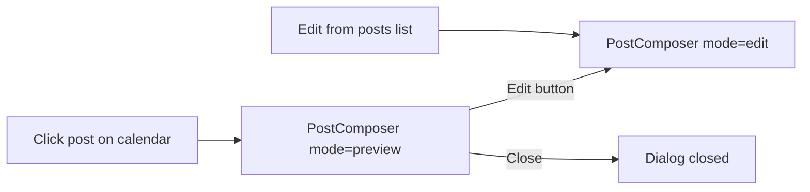
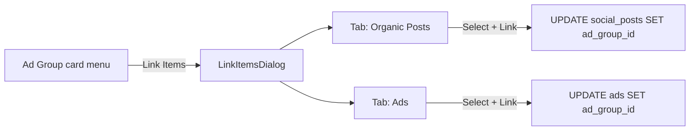

# Social Module -- Polish Phase Plan (Rev 2 -- Tech Lead Review)

## 1. Post Detail / Preview Mode

**Problem:** Clicking any post on the calendar immediately opens the edit form. Users need a read-only preview to inspect a post before deciding to edit.

**Approach:** Extend the existing `PostComposer` dialog rather than building a separate component. Add a third `mode` value: `"preview"`.

### Files to change

- **[src/components/social/planner/PostComposer.tsx](src/components/social/planner/PostComposer.tsx)**
  - **Add `media_urls` to `SocialPostFormData`** so the preview mode can render media thumbnails:

```typescript
    export interface SocialPostFormData {
      platform_ids: string[];
      post_type: string;
      content: string;
      status: string;
      hashtags: string;
      scheduled_at?: string;
      media_urls?: string[] | null;   // <-- NEW
    }
    

```

- Widen `mode` prop type: `"create" | "edit" | "preview"`.
- Add optional callback to `PostComposerProps`:

```typescript
    onRequestEdit?: () => void;
    

```

- When `mode === "preview"`:
  - Render all fields as read-only (disabled inputs / plain text display).
  - If `formData.media_urls` has entries, render a horizontal thumbnail strip (rounded images, max-h constrained).
  - Render hashtags as inline `Badge` components instead of a raw comma string.
  - Hide the submit button row entirely.
  - Show a primary "Edit" button in the footer that calls `onRequestEdit`.
- Title string: "รายละเอียดโพสต์" (Post Detail).
- In create/edit modes, `media_urls` is ignored by the form (no input field needed now -- media upload is a future feature).
- **[src/pages/social/SocialPlanner.tsx](src/pages/social/SocialPlanner.tsx)**
  - **Widen the `composerMode` state type** from `"create" | "edit"` to `"create" | "edit" | "preview"`:

```typescript
    const [composerMode, setComposerMode] =
      useState<"create" | "edit" | "preview">("create");
    

```

- Change `openEditFromCalendar` to set `composerMode` to `"preview"` (not `"edit"`). Also pass `media_urls` from the `CalendarPost` into `composerInitialData`.
- Add a new handler:

```typescript
    const switchToEdit = () => setComposerMode("edit");
    

```

```
This keeps `composerOpen = true` and the same `composerInitialData` / `editingPostId` intact.
```

- Pass `onRequestEdit={switchToEdit}` to `PostComposer`.

### UI flow




---

## 2. Missing Published Posts on Calendar

**Problem:** The Supabase query in `useSocialCalendar` uses `.gte("scheduled_at", startDate)`. Posts with `scheduled_at = null` (published immediately) are excluded at the database level and never reach the client-side `groupByDate` fallback.

**Root cause (line 65):**

```61:67:src/hooks/useSocialCalendar.tsx
      const { data: rawData, error: queryError } = await supabase
        .from("social_posts")
        .select("*, platforms(name, slug, icon_url)")
        .eq("team_id", workspace.id)
        .gte("scheduled_at", startDate)
        .in("status", ["draft", "scheduled", "published"])
        .order("scheduled_at", { ascending: true });
```

### Files to change

- **[src/hooks/useSocialCalendar.tsx](src/hooks/useSocialCalendar.tsx)**
  - Replace the single `.gte("scheduled_at", startDate)` filter with an `.or()` compound filter:

```
    .or(`scheduled_at.gte.${startDate},and(scheduled_at.is.null,published_at.gte.${startDate})`)
    

```

```
This fetches posts where **either** `scheduled_at >= startDate` **or** (`scheduled_at` is null **and** `published_at >= startDate`).
```

- No changes to `groupByDate` -- it already falls back to `published_at`.
- Ordering: keep primary order by `scheduled_at` ascending (nulls will appear together); add secondary `.order("published_at", { ascending: true })` so published-only posts sort chronologically.
- **[src/components/social/planner/ScheduledPostCard.tsx](src/components/social/planner/ScheduledPostCard.tsx)** (minor)
  - Currently `formatTime` only reads `scheduled_at`. For published posts with no `scheduled_at`, fall back to display `published_at` time so the time chip is not empty:

```typescript
    const time = formatTime(post.scheduled_at) ?? formatTime(post.published_at);
    

```

### Verification

After the fix, a post with `status = "published"`, `scheduled_at = null`, and `published_at = "2026-03-10T14:00:00Z"` should appear on the March 10 cell when the date range covers that date.

---

## 3. Ad Group Assignment (Link Post / Ad)

**Problem:** Users can create Ad Groups, but there is no way to assign an existing organic post or an existing ad into an Ad Group.

### 3a. Schema: add `ad_group_id` to `social_posts`

The `ads` table already has `ad_group_id` (FK to `ad_groups`). The `social_posts` table does **not**. We need a new migration.

- **New migration file:** `supabase/migrations/20260315120000_add_ad_group_id_to_social_posts.sql`

```sql
  ALTER TABLE public.social_posts
    ADD COLUMN ad_group_id uuid REFERENCES public.ad_groups(id) ON DELETE SET NULL;

  CREATE INDEX idx_social_posts_ad_group_id ON public.social_posts(ad_group_id);
  

```

  Keep the column nullable -- most organic posts will not be in an ad group.

- After running the migration, **regenerate Supabase types** (`npx supabase gen types typescript ...`) so `social_posts.ad_group_id` appears in `types.ts`.

### 3b. Hook changes -- with SECURITY FIX

**CRITICAL (cross-workspace data leak):** The current `useAdGroups` hook fetches **all** ads across every workspace to count `ads_count`. The sub-query at line 36-38 is missing a `team_id` filter:

```35:48:src/hooks/useAdGroups.tsx
      // Get ads count for each group
      const { data: ads, error: adsError } = await supabase
        .from("ads")
        .select("ad_group_id");
      // ^^^ BUG: No .eq("team_id", workspace.id) -- leaks cross-workspace counts

      if (adsError) throw adsError;

      // Count ads per group
      const adsCountMap = ads?.reduce((acc, ad) => {
        if (ad.ad_group_id) {
          acc[ad.ad_group_id] = (acc[ad.ad_group_id] || 0) + 1;
        }
        return acc;
      }, {} as Record<string, number>) || {};
```

- **[src/hooks/useAdGroups.tsx](src/hooks/useAdGroups.tsx)** -- full list of changes:
  1. **Fix existing ads sub-query** -- add `.eq("team_id", workspace.id)`:

```typescript
     const { data: ads, error: adsError } = await supabase
       .from("ads")
       .select("ad_group_id")
       .eq("team_id", workspace.id);   // <-- SECURITY FIX
     

```

1. **Add parallel posts sub-query** -- also scoped to workspace:

```typescript
     const { data: posts, error: postsError } = await supabase
       .from("social_posts")
       .select("ad_group_id")
       .eq("team_id", workspace.id)    // <-- workspace-scoped
       .not("ad_group_id", "is", null);
     

```

1. **Extend `AdGroupWithCount` interface** to include `posts_count`:

```typescript
     export interface AdGroupWithCount extends AdGroup {
       ads_count: number;
       posts_count: number;
     }
     

```

1. **Build a `postsCountMap`** (same reduce pattern as `adsCountMap`) and merge both counts into each group.
2. **Add two new mutations:**
  - `linkItemsToGroup({ groupId, adIds?, postIds? })` -- for each non-empty array, runs an `UPDATE ... SET ad_group_id = groupId WHERE id IN (...)`.
  - `unlinkItemFromGroup({ table: "ads" | "social_posts", itemId })` -- sets `ad_group_id = null`.
3. **Invalidation:** both mutations invalidate `["ad_groups"]`, `["social_posts"]`, and `["social_calendar"]`.

### 3c. UI: "Link Post/Ad" dialog in AdGroupsList

- **[src/components/social/analytics/AdGroupsList.tsx](src/components/social/analytics/AdGroupsList.tsx)**
  - Add a new "Link Items" (`เชื่อมโยงโพสต์/โฆษณา`) option in each ad group card's dropdown menu (alongside Edit, Toggle, Delete).
  - Update the card footer to show **both** counts: `{group.ads_count} โฆษณา / {group.posts_count} โพสต์`.
  - This opens a new **LinkItemsDialog** component.
- **New component:** `src/components/social/analytics/LinkItemsDialog.tsx`
  - Props: `groupId`, `groupName`, `open`, `onOpenChange`.
  - Two tabs (shadcn `Tabs`): "Organic Posts" and "Ads".
  - Each tab shows a searchable/filterable list of unlinked items (i.e., where `ad_group_id IS NULL`) scoped to the workspace.
  - Each row has a checkbox. A "Link Selected" button calls the `linkItemsToGroup` mutation.
  - Already-linked items (linked to **this** group) are shown at the top with an "Unlink" button.

### UI flow




### Data queries inside LinkItemsDialog

All queries MUST be scoped to `workspace.id`:

- **Unlinked organic posts:**

```
  supabase.from("social_posts")
    .select("id, content, platform_id, status, scheduled_at")
    .eq("team_id", workspaceId)
    .is("ad_group_id", null)
  

```

- **Unlinked ads:**

```
  supabase.from("ads")
    .select("id, name, status, headline")
    .eq("team_id", workspaceId)
    .is("ad_group_id", null)
  

```

- **Already linked (this group):**

```
  supabase.from("social_posts").select("...").eq("ad_group_id", groupId)
  supabase.from("ads").select("...").eq("ad_group_id", groupId)
  

```

---

## Summary of all touched files

- `src/components/social/planner/PostComposer.tsx` -- Add `media_urls` to form data interface; add `preview` mode with read-only rendering and `onRequestEdit` callback
- `src/pages/social/SocialPlanner.tsx` -- Widen `composerMode` state to `"create" | "edit" | "preview"`; open calendar posts in preview; add `switchToEdit` handler
- `src/hooks/useSocialCalendar.tsx` -- Fix `.or()` filter to include published posts with null `scheduled_at`
- `src/components/social/planner/ScheduledPostCard.tsx` -- Fallback time display to `published_at`
- `src/hooks/useAdGroups.tsx` -- **Security fix:** add `team_id` filter to ads count query; add workspace-scoped `posts_count`; add `linkItemsToGroup` / `unlinkItemFromGroup` mutations
- `src/components/social/analytics/AdGroupsList.tsx` -- Add "Link Items" menu option; show both ads and posts counts; wire `LinkItemsDialog`
- `src/components/social/analytics/LinkItemsDialog.tsx` -- **New** -- dialog with tabs for linking posts and ads to an ad group
- `supabase/migrations/20260315120000_add_ad_group_id_to_social_posts.sql` -- **New** -- add nullable `ad_group_id` FK column + index

